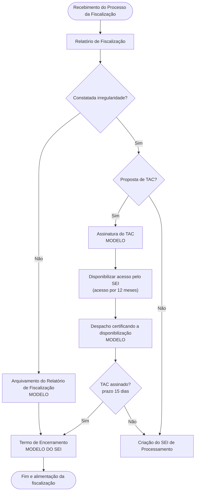
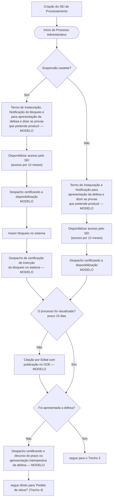
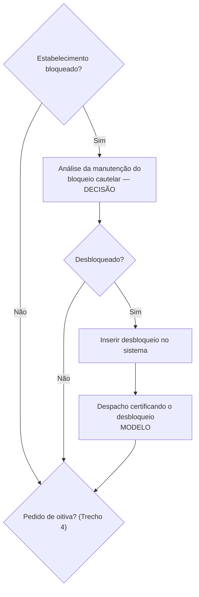
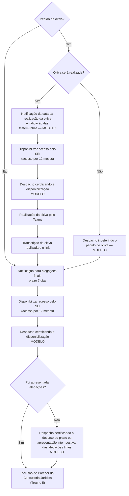
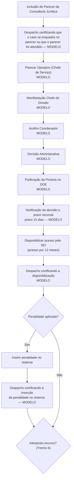
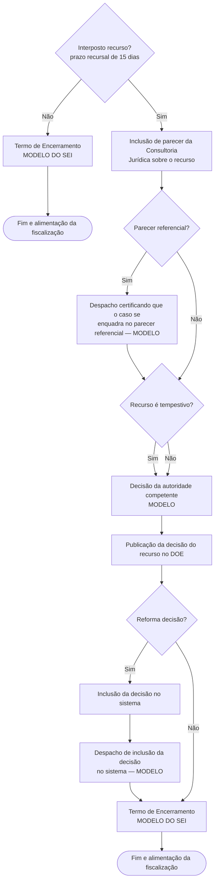

# Fluxo oficial do Processo Administrativo Sancionatório

> Transcrição fiel do fluxograma entregue pela área de negócio.
> Fonte: `fluxo-processo-administrativo-sancionatorio.pdf` (mesma pasta).
> Render em PNG para leitura rápida: `fluxo-processo-administrativo-sancionatorio.png`.
>
> **Este é o documento de referência para a ordem das fases e dos documentos.**
> Quando o código e este arquivo divergirem, o fluxograma manda — e a divergência
> deve ser levada à área antes de mudar código.

## Legenda do fluxograma

| Marca no desenho | Significado |
|---|---|
| Texto em vermelho | Evento que precisa gerar registro de data/hora |
| `MODELO` (tarja amarela) | Existe texto-padrão nosso para o documento |
| `MODELO DO SEI` | Usa modelo próprio do SEI (termo de encerramento) |
| `DECISÃO` | Documento da série Decisão |
| Losango | Ponto de decisão do analista ou do sistema |
| Balão amarelo | Anotação da área (automação desejada) |

Padrão que se repete em todo o fluxo: **toda notificação ao interessado vem
acompanhada de "Disponibilizar acesso ao usuário pelo Sistema SEI" (liberação de
acesso ao processo por 12 meses) seguida de "Despacho certificando a
disponibilização de acesso"**.

---

## Trecho 1 — Triagem do relatório e TAC

Anotações da área grudadas em "Criação do SEI de Processamento":

- Criação de "Processo Relacionado".
- Encerramento automatizado do SEI de Fiscalização.

---

## Trecho 2 — Instauração e defesa prévia

Detalhe importante: o caminho do **decurso de prazo da defesa** não passa pela
análise da cautelar — ele desce direto para o ponto "Pedido de oitiva?".

---

## Trecho 3 — Revisão da medida cautelar

Só entra quando houve defesa apresentada.

---

## Trecho 4 — Oitiva e alegações finais

---

## Trecho 5 — Julgamento e decisão administrativa

Ordem dos pareceres, de baixo para cima no desenho: Chefe de Serviço opina →
Chefe de Divisão se manifesta → Coordenador acolhe → Decisão Administrativa.

---

## Trecho 6 — Recurso

Ponto que costuma confundir: **tempestivo e intempestivo desembocam no mesmo
lugar** — "Decisão da autoridade competente". O recurso intempestivo não é
descartado sem decisão; a autoridade decide (não conhecer, no caso).

---

## Prazos que o fluxograma fixa

| Momento | Prazo |
|---|---|
| Assinatura do TAC | 15 dias |
| Visualização do processo / apresentação da defesa | 15 dias |
| Alegações finais | 7 dias |
| Recurso (a contar da notificação da decisão) | 15 dias |
| Validade do acesso externo liberado no SEI | 12 meses |

---

## Dados que a área quer registrar

- Data/hora de cada evento marcado em vermelho no fluxograma.
- Quantos dias entre eventos.
- Servidor que criou o documento.
- Servidor que assinou.
- Produtividade por servidor.
- Contagem de processos por agente regulado.
- Tempo de duração do processo (recebimento do processo da fiscalização → termo
  de encerramento).
- Relação de data/hora e quais usuários externos (e-mail) acessaram o processo.

## Objetivos declarados pela área

- Contar cautelar e o prazo que está suspenso.
- Alerta de processo sem tramitação há mais de XX dias (valor editável).
- Alerta de processos com mais de 90 dias sem termo de encerramento.
- Atribuir e consultar atribuição de processos.
- Processo concluído sem o termo de encerramento.
- Gestão da disponibilização de acesso externo (automação).
- Fila de processos (pensando em um FIFO).
- Flag quando inserido um documento externo no processo.
- Possibilidade de inserir despacho saneador.
- Alerta de certidões não incluídas quando o fluxo exigir.

---

## Como o fluxo oficial se encaixa nas fases do app

Fases implementadas em `backend/app/services/catalogo_fases.py` e rotuladas em
`frontend/src/features/processosAndamento/fases.ts`.

| Trecho do fluxograma | Fase no app | Observação |
|---|---|---|
| Triagem / arquivamento do relatório | fora das fases (`ARQUIVAMENTO_RELATORIO`) | acontece no SEI de fiscalização |
| TAC | não modelado como fase | rota em `services/despachos_sei.py` |
| Termo de instauração + notificação | `instauracao` | |
| Prazo de 15 dias, edital, decurso | `aguardando_defesa` | automação `verificar_prazos.py` |
| Revisão da cautelar + saneamento | `defesa_apresentada` | o app usa despacho saneador |
| Intimação para alegações finais | `instrucao` | prazo de 7 dias |
| Prazo de alegações correndo | `aguardando_alegacoes` | |
| Parecer CJ → opinativo → decisão | `julgamento` | |
| Notificação da decisão e prazo recursal | `recurso` | |
| Termo de encerramento + arquivamento | `encerramento` | |

### Pontos do fluxo oficial ainda sem passo próprio no app

Levantados na leitura do fluxograma, **sem alteração de código** — precisam de
decisão da área antes de virar implementação:

- Ramo da **oitiva** inteiro: pedido, deferimento/indeferimento, notificação da
  data e testemunhas, realização pelo Teams, transcrição e link.
- **Revisão da cautelar** depois da defesa (análise da manutenção, desbloqueio,
  despacho certificando o desbloqueio). Existem as funções
  `cautelar_manutencao` e `cautelar_revogacao` no mapa de séries, mas nenhum
  passo de fase as usa.
- **Inserir bloqueio / desbloqueio / penalidade no sistema** — ações em sistema
  externo, com despacho de certificação depois de cada uma.
- Ramo do **recurso** além da notificação: parecer da CJ sobre o recurso,
  parecer referencial, tempestividade, decisão da autoridade competente,
  publicação no DOE e reforma da decisão.
- **TAC com prazo de 15 dias** para assinatura antes de criar o SEI de
  processamento.
- O **despacho saneador** que o app usa na fase `defesa_apresentada` não aparece
  no fluxograma como caixa; ele consta apenas na lista de objetivos
  ("possibilidade de inserir despacho saneador").
