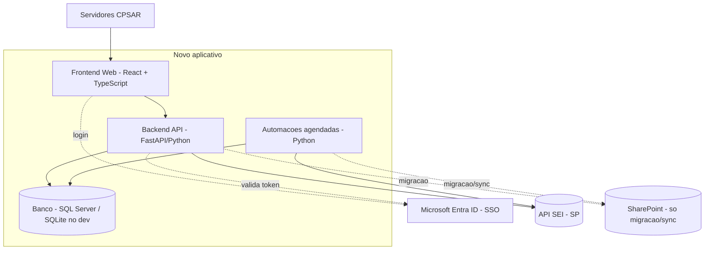

# Documentação Técnica — Sistema de Processamento Sancionatório (CPSAR)

> Documento vivo: atualizado conforme o desenvolvimento avança. Veja o histórico no fim.

| Campo | Valor |
|---|---|
| Projeto | Reconstrução do app "DETRAN - DGR - Processamento (Novo)", hoje em Power Apps, como solução própria |
| Versão do documento | 0.33.2 |
| Última atualização | agosto/2026 |
| Status | Em desenvolvimento |

## Sumário
1. Visão geral
2. Arquitetura
3. Stack tecnológica
4. Estrutura do repositório
5. Backend
6. Frontend
7. Migração de dados (SharePoint → banco)
8. Banco de dados
9. Infraestrutura e ambientes
10. Segurança
11. Testes
12. Como rodar (desenvolvimento)
13. Status e roadmap
14. Histórico de atualizações

## 1. Visão geral

O sistema apoia a Coordenadoria de Processamento Sancionatório dos Agentes Regulados (CPSAR)
a conduzir o ciclo de vida dos processos sancionatórios, substituindo o aplicativo atual em
Power Apps por uma solução própria, sem as limitações da plataforma.

Ele se integra ao SEI (sistema oficial de processos) via API e, na fase de transição, ao
SharePoint (origem atual dos dados) via Microsoft Graph, apenas para migrar os dados para o
banco próprio do novo sistema.

## 2. Arquitetura



Camadas:
- Frontend (React): interface usada pelos servidores; depois do build vira arquivos estáticos servidos no navegador.
- Backend (FastAPI/Python): expõe a API, valida o login (Entra ID), fala com o SEI e o banco.
- Automações (Python): rotinas agendadas que consultam o SEI várias vezes ao dia (ex.: varredura da caixa de entrada) e gravam no banco.
- Banco de dados: SQL Server em produção; SQLite no desenvolvimento local (troca via configuração).
- SEI: sistema oficial de processos, consumido pela API.
- SharePoint: apenas na migração inicial e sincronizações pontuais (via Microsoft Graph).

## 3. Stack tecnológica

> **Migração para o padrão DTI em andamento.** A stack aprovada da plataforma é
> **NestJS + Prisma + PostgreSQL** no backend e **React + Vite + MUI v6** no
> frontend (ver `.kiro/steering/tech.md`). O backend Python descrito abaixo
> continua no ar e é migrado domínio por domínio; enquanto isso, a API NestJS
> repassa ao FastAPI os caminhos ainda não portados
> (`apps/api/src/app/legacy/`). Situação em 12/08/2026: **57 de 125 endpoints**
> migrados — anotações internas (3), `/me` (1), usuários (5), advogados (8),
> controle de prazos (3), auditoria/alertas (2), recurso/Decisão II (4),
> Consulta Unificada (4), exportação para BI (4), cautelares (11) e
> biblioteca (12).
>
> **Os domínios que só usam o banco estão concluídos.** Os 68 restantes dependem
> do cliente do SEI, ainda em Python: caixa de entrada (7), despachos (7),
> documentos (6), fases (9), textos-padrão (11), processos em andamento (23),
> busca (1) e histórico. Notificações (3) depende dele apenas em parte — a
> listagem dispara uma varredura no SEI para detectar documentos externos.
>
> Portar `app/integrations/sei/client.py` (autenticação, token, retry e as
> chamadas de processo e documento) é a maior dependência isolada que resta.
>
> **Permissão e competência são camadas distintas.** A permissão do Gestão de
> Acessos dá acesso ao endpoint e é reconfigurável sem deploy. A competência
> legal — só o Coordenador Geral aplica, renova ou revoga medida cautelar, art.
> 62, parágrafo único, da Lei 10.177/1998; só a Coordenação profere a Decisão II
> — é verificada por perfil no código, porque alterá-la seria alterar quem a lei
> autoriza, não uma configuração de acesso.
>
> Atenção ao caso do recurso: ele vive sob `/processos-andamento/{id}/recurso`,
> mas o **restante** daquele domínio segue no Python. É por isso que os padrões
> de `ROTAS_MIGRADAS` são ancorados rota por rota, e não por prefixo — um padrão
> largo como `/processos-andamento/\d+` engoliria os 23 endpoints ainda não
> portados, que passariam a responder 404.
>
> **Notificações ficam para depois do cliente do SEI de propósito:**
> `GET /notificacoes` dispara em segundo plano uma varredura no SEI para
> detectar documentos externos juntados ao processo. Migrar a rota sem essa
> varredura faria a detecção parar de rodar nos dois backends — o Python
> deixaria de receber a rota, e o NestJS não teria o que executar.

Stack de destino (padrão da plataforma):
- Node.js 20 + TypeScript 5.4 (modo estrito)
- NestJS 10 (API), class-validator (validação), Jest (testes)
- Prisma 5 + PostgreSQL 16 (um schema por domínio: `processamento`)
- React 18 + Vite 5 + MUI v6 (frontend)
- Autorização pelo schema `gestao_acessos_v2`, somente leitura

Backend atual (em migração):
- Python (desenvolvimento atual em 3.14; suportado 3.12+)
- FastAPI (API), Uvicorn (servidor), Pydantic (validação)
- SQLAlchemy 2 (ORM / acesso ao banco)
- requests (chamadas HTTP a SEI e Graph), python-dotenv (configuração)
- PyJWT[crypto] (validação do token do Entra ID)
- pytest + httpx (testes)
- pyodbc + ODBC Driver for SQL Server (a adicionar para conectar no SQL Server)

Frontend:
- Node.js 20 + npm workspaces (o padrão fixa a 20; o host de desenvolvimento tem 24)
- React 18 + TypeScript, build com Vite 5
- Vitest + Testing Library (testes)
- Tailwind CSS — **a substituir por MUI v6**, que o padrão exige
  (`.kiro/steering/frontend-react.md` proíbe frameworks CSS adicionais)

Banco de dados:
- PostgreSQL 16 (alvo, já em uso pela API NestJS) / SQLite (backend Python em
  desenvolvimento local)

## 4. Estrutura do repositório

Layout canônico da plataforma (`.kiro/steering/structure.md`): monorepo com
npm workspaces, `apps/api` e `apps/web`, e `prisma/` na raiz.

```
projeto_processamento/
  package.json        # workspaces + scripts (dev:api, dev:web, build:*, prisma:*)
  .npmrc              # escopo @detran -> GitHub Packages
  manifest.json       # identidade do sistema e stack
  .env.example        # modelo do .env ÚNICO da raiz
  docker-compose.yml         # PostgreSQL + API (desenvolvimento)
  homolog.docker-compose.yml # processamento-back:3001 / -front:3000
  apps/
    api/              # backend NestJS (porta 3001)
      src/
        main.ts       # setGlobalPrefix("api"), /health fora do prefixo
        integrations/
          sei/          # cliente da API do SEI (3 camadas — ver seção 5.1)
        app/
          auth/         # identidade: UsuarioAtualGuard, @UsuarioAtual()
          permissions/  # PermissionGuard, @RequirePermission, banco de acessos
          legacy/       # PONTE TEMPORÁRIA para o FastAPI (remover no fim)
          anotacoes/    # 1º domínio migrado: controller, service, module, dto/
        shared/         # PrismaService
    web/              # frontend React + Vite (5173 em dev, 3000 no contêiner)
      src/
        api/            # client.ts (BASE_API — única fonte da URL)
        features/       # 13 áreas: caixaEntrada, analise, prazos, cautelares...
        components/     # Layout, PesquisaGlobal, NotificacoesDropdown
        lib/            # format.ts
  prisma/
    schema.prisma     # 28 models (paridade com o modelo Python)
    migrations/       # versionadas
    dev/              # seed do gestao_acessos_v2 para desenvolvimento local
  backend/            # BACKEND PYTHON — em migração, ainda no ar
    app/              # api/routes (22 arquivos), core, db, integrations, services
    automacoes/       # varredura_sei, verificar_prazos, sincronizar_*, limpar_*
    tests/            # pytest
  .kiro/
    steering/         # 17 canônicos + dominio.md, api-sei.md, sharepoint-*.md
    skills/           # 17 skills da plataforma
  docs/
    negocio/          # documentação de negócio
    tecnica/          # este documento
```

## 5. Backend

### 5.1 Integração com o SEI (`app/integrations/sei/client.py`)
- Autenticação OAuth2 `client_credentials` no IdP (`idp.sp.gov.br`), com cache do token (renovação protegida por lock, para o cliente poder ser compartilhado entre requests).
- **Cliente compartilhado** (`app/core/sei_shared.py`): `get_sei_client()` devolve uma única instância por processo, e `get_graph_client()` resolve o `site_id` do SharePoint uma vez e reaproveita. Antes cada request criava um cliente novo e refazia o OAuth — principal causa de lentidão nas telas.
- Base da API: `sei-processos.api.rota.sp.gov.br` (há ambiente de homologação `api-hml`).
- Cabeçalhos: `X-SiglaSistema` (CSDR_PROCESSAMENTO), `X-IdUnidade`, `X-IdentificacaoServico`, `X-TraceId-SP`, `Authorization: Bearer`.
- Métodos: `listar_processos`, `consultar_processo`, `listar_andamentos`, util `limpar_numero`.
- Endpoints usados: `GET /processos`, `GET /processos/{numero}`, `GET /andamentos/completo`.
- Observação a validar com a doc do SEI: parâmetros de `/andamentos/completo` enviados como query string (padrão da automação de produção).

### 5.2 Integração com o Microsoft Graph (`app/integrations/graph/client.py`)
- Usado para ler listas do SharePoint na migração. Auth OAuth2 `client_credentials` (`login.microsoftonline.com`, escopo `graph/.default`).
- Métodos: `get_site_id`, `listar_listas`, `obter_id_lista`, `iter_itens` (com paginação).

### 5.3 Modelo de dados (`app/db/models.py`)
Entidades (preliminares, a refinar com a área): `AgenteRegulado`, `Relatorio`, `CaixaEntrada`,
`Processo`, `FaseProcesso`, `Prazo`, `Cautelar`, `Feriado`, `Usuario`.
Conexão configurável por `DATABASE_URL` (SQLite no dev, SQL Server em produção).

`ConsultaUnificada`: tabela que alimenta a tela homônima, consolidando relatórios de fiscalização (da `listaDesignacao` inteira, ~19 mil linhas, inclusive fiscalizações que nunca entraram na caixa de entrada) e processos sancionatórios (da nossa base, com a fase atual). É materializada porque as datas exigidas pela tela vêm do SEI — uma chamada por linha —, então consultar ao vivo tornaria a tela inviável. Alimentada por `automacoes/sincronizar_consulta_unificada.py`.

As duas datas saem de `GET /processos/{numero}?sinRetornarUltimoAndamento=true`: `data_criacao_sei` é a `dataAutuacao` e `data_ultima_acao` vem de `ultimoAndamento.dataHora`. A mesma resposta traz o `idProcedimento`, que fica gravado. Isso é o que permite datar **toda** linha: a versão anterior usava `/andamentos/completo`, que exige o `idProcedimento` de antemão, e nenhum relatório vindo só da `listaDesignacao` tem esse ID — 18.866 das 18.868 linhas ficavam sem data.

A propriedade `ConsultaUnificada.fonte` (derivada, não é coluna) devolve `processamento` quando `caixa_entrada_id` está preenchido e `fiscalizacao` quando não. É a base do filtro "Fonte dos dados" da tela, e é mais ampla que "tem processo instaurado": inclui o que chegou à caixa e ainda aguarda triagem, ou foi arquivado.

**Vocabulário único de agente regulado** (`app/services/agentes_regulados.py`): o app nasceu com dois vocabulários — o da fiscalização ("Centros de formação de condutores – CFC B", "Empresas credenciadas de vistoria – Remota", "Médicos") e o do CPSAR, no plural ("Peritos", "Desmontes", "EPIV"). Ambos foram substituídos por seis classes: **Autoescola, Perito, Desmonte, Despachante, ECV, Estampadora**. Pátios, Renave, "Médicos e psicólogos" e Instituições de ensino saem do app.

A adoção nas tabelas existentes é feita por `scripts/renomear_agentes.py` (com `--dry-run`), que cobre `caixa_entrada`, `consulta_unificada`, `config_unidade`, `config_bloco_assinatura`, `config_template_despacho` e `config_tipo_procedimento`. Nome desconhecido é preservado, para aparecer no filtro em vez de desaparecer sem aviso.

**Subclasses de Perito.** `GET /processos/tipos` (API de processos, uma chamada por unidade — `scripts/listar_tipos_procedimento_sei.py`) confirmou que o SEI **não tem** tipo de procedimento único para perito: existem Clínica (100002002), Médico (100002001) e Psicólogo (100002006), separados. Então a classe consolidada não basta para instaurar. `CaixaEntrada.agente_origem` guarda o nome como veio da listaDesignacao, `agentes_regulados.subclasse()` deriva dele a subclasse, e `config_tipo_procedimento` usa a chave `Perito | <subclasse>`. Sem o agente de origem a busca falha de propósito, com mensagem explicando o motivo — escolher um dos três ao acaso abriria o processo com o tipo errado no SEI.

Esta distinção já estava perdida antes: a varredura sempre gravou só a classe consolidada, e não existia linha correspondente em `config_tipo_procedimento`, então a instauração de perito caía no fallback do SharePoint. A coluna `agente_origem` é adicionada por `scripts/migrar_agente_origem.py` (`ALTER TABLE` aditivo, com `--dry-run`), que também preenche os itens existentes pela listaDesignacao.

**`ConfigTemplateDespacho`: modelo em uso, original e padrão.** Além de `agente_regulado`, `descricao_doc` (`<função>|<rótulo>`), `template_html` e `nome_arvore`, a tabela guarda `padrao` (a variante escolhida como padrão do app para aquela função e agente — há quatro saneadores de autoescola e nove arquivamentos de relatório de perito, e é essa marca que decide qual vem selecionada), `html_original` (o texto como veio do SEI, para comparar e restaurar) e `editado_em`/`editado_por`. Enquanto `editado_em` estiver preenchido, `scripts/importar_textos_padroes.py` não sobrescreve `template_html`: sem isso, a próxima coleta apagaria o ajuste da coordenação sem aviso. As quatro colunas são adicionadas por `scripts/migrar_edicao_textos_padroes.py` (`ALTER TABLE` aditivo e idempotente, com `--dry-run`), que também copia o texto atual para `html_original`.

Verificado ainda que cada tipo está habilitado na unidade que instaura aquela classe. O tipo de Autoescola (100003458) existe em uma única unidade — justamente a 110051042, a dela.

**Prazos, cautelares, recurso e auditoria (Doc. de Negócio v3.0).** A contagem de prazos segue a Lei 10.177/1998 em `app/services/calculo_prazos.py`, que também guarda a matriz parametrizável dos 12 prazos e o semáforo usado nas telas de prazos e de cautelares. `CaixaEntrada` ganhou `responsavel_id` e os campos de priorização (`prioritario`, `prioridade_justificativa`, `prioridade_definida_por`, `prioridade_definida_em`). `Cautelar` ganhou `caixa_entrada_id` — o fluxo real do app vive em `CaixaEntrada`, e a tela lia a tabela `processo`, que a instauração nunca populou —, os campos de concordância do Coordenador Geral e os de revogação. Tabelas novas: `recurso_processo` (interposição, parecer jurídico e Decisão II, com histórico próprio porque o retorno de fase permite um segundo recurso) e `auditoria` (usuário, momento, operação, entidade, registro e documento afetado).

Campos derivados de fontes externas:
- `CaixaEntrada.total_apontamentos` / `total_itens_avaliados`: não conformidades do checklist, apuradas de **lista_perguntas** + **lista_resposta** (site CQCFAR) — ver `app/services/conformidade_relatorio.py`. A coluna `Conformidade` da lista_perguntas indica **qual resposta caracteriza conformidade** naquela pergunta (as perguntas são escritas nos dois sentidos), então há apontamento quando a resposta difere da esperada. Ficam fora da apuração as perguntas de texto livre (Conformidade vazia) e os itens marcados como "não se aplica" — tanto na coluna `Conformidade` (`N/A`, `Não se aplica`, `Notificação para regularização`) quanto na resposta do fiscal. Persistidos para a tela abrir sem depender do SharePoint; a lista detalhada é apurada ao vivo pelo endpoint.
- `CaixaEntrada.municipio` / `superintendencia`: resolvidos a partir de `listaDesignacao.cidade` via **listaMunicipios** (site DGR) — ver `app/services/localizacao_agente.py`. A lista guarda o município em duas grafias; casamos pela versão sem acento e gravamos a acentuada, pronta para exibir. Preenchidos pela varredura nos itens novos e por `scripts/preencher_localizacao.py` nos antigos.

Notas de desempenho no modelo:
- `CaixaEntrada.conteudo_html` (HTML do relatório, em geral > 1 MB por item) é **deferred**: só é lido quando acessado. Sem isso, uma listagem de algumas centenas de itens carregava centenas de MB do banco para a memória mesmo sem devolver o campo na resposta.
- `CaixaEntrada.verificado_em` registra quando a automação de limpeza checou o item pela última vez, permitindo verificar em rotação em vez de reverificar tudo a cada ciclo.
- `CacheSei` (`app/services/cache_sei.py`): cache persistente de respostas do SEI. Conteúdo de documento (`doc:*`) não expira, pois documento assinado no SEI não muda; listas de documentos e histórico (`docs:*`, `hist:*`) usam TTL de 5 min e são invalidadas na hora quando o app inclui um documento no processo. Falhas de cache nunca propagam — cai direto no SEI.

### 5.4 API (`app/main.py` e `app/api/`)
- `GET /health` — verificação de saúde.
- `GET /me` — dados do usuário autenticado (saudação no frontend) e `coordenador`, que decide a exibição do menu "Textos-padrão".
- `GET /caixa-entrada` — lista itens com filtros: `busca` (Nº SEI ou CNPJ/CPF, com ou sem máscara), `agente`, `data_inicio`, `data_fim` e paginação (`limit`/`offset`). Ordenação por `ordenar_por` (`data_recebimento`, `razao_social`) e `ordem` (`asc`/`desc`), padrão `data_recebimento` + `desc`; a ordem alfabética usa `lower()` e o desempate é por `id`, para itens do mesmo dia não trocarem de lugar entre atualizações. Coluna desconhecida cai no padrão em vez de dar erro.
- `GET /caixa-entrada/agentes` — agentes regulados distintos (para o filtro).
- `GET /caixa-entrada/{id}/apontamentos` — não conformidades do checklist de fiscalização (total, itens avaliados e a lista detalhada com o enquadramento legal).
- `GET /busca` — pesquisa unificada da barra do cabeçalho. Procura por Nº SEI (com ou sem máscara), CNPJ/CPF ou razão social e devolve cada candidato já classificado como `relatorio` ou `processo`, o que permite o frontend abrir a tela correta.
- `GET /consulta-unificada` — visão consolidada de relatórios e processos. Filtros: busca, tipo, **fonte**, agente, situação, **fase**, ano e **período** de criação (`criacao_de`/`criacao_ate`) e de última ação (`acao_de`/`acao_ate`). Ordenação por `ordenar_por` (criacao, ultima_acao, razao_social, numero_sei, cnpj_cpf, agente, situacao, fase) e `ordem` (asc/desc); valores nulos ficam sempre no fim, e o desempate é por `id` para a paginação não repetir nem pular linha. Página de 100 itens. `GET /consulta-unificada/agentes`, `/situacoes` e `/fases` alimentam os filtros e aceitam `tipo` e `fonte`, para não oferecerem opção impossível — filtrando só relatórios, "Processo instaurado" não aparece entre as situações. `/fases` devolve na ordem oficial do processo, não alfabética.
- **Mala direta dos modelos** (`app/services/mala_direta.py`): os três `GET /caixa-entrada/{id}/despachos/*` e o `GET /processos-andamento/{id}/fase-acao/template` devolvem, além do `html`, a lista `marcadores` — as lacunas escritas entre colchetes no texto-padrão, cada uma com `id` (chave do campo no formulário), `token` (trecho literal, usado na substituição), `rotulo`, `tipo`, `total`, `indice`, `opcoes`, `valor_sugerido`, `campo` e `preenchivel`. **Marcador repetido gera um campo ou vários, conforme o tipo:** cadastral repete o mesmo dado por definição (`[NOME DA EMPRESA]` 4x no Despacho 141, `[link sei]` 6x nas certidões) e vira um campo com `indice: null`, aplicado em todas as posições; texto, data e escolha ganham um campo por ocorrência (`indice` 1..N), porque `[descrição]` 3x no termo de instauração são os itens "1.", "2." e "3." — três condutas diferentes, e um campo só faria a mesma frase entrar nos três. Cada campo traz `contexto`, o trecho do documento em volta da lacuna com `___` no lugar dela: é o que identifica lacunas de rótulo idêntico, já que no termo de instauração a finalidade de cada `[descrição]` está escrita **depois** dela ("Citar irregularidades segundo relatório de fiscalização", "CITAR se há outro processo em andamento"). Não se tenta transformar o colchete vizinho em rótulo: nos 50 casos de marcadores adjacentes dos modelos, o vizinho é instrução, alternativa (`[ou]`) ou exemplo, sem regra única. O contexto vai no `title` do rótulo, não em linha própria, para o formulário não virar um paredão de texto. Campo livre é `multivalor`: **a quantidade sai do caso, não do modelo** — várias irregularidades, vários sócios, vários vistoriadores. A tela oferece um "+ Acrescentar" e os valores são unidos em linguagem natural ("A, B e C"), porque a lacuna fica dentro de uma frase e quebrar linha ali partiria o período. **Nome de terceiro não recebe a razão social:** `[NOME DO SÓCIO-ADMINISTRADOR]`, `[Nome do vistoriador]` e afins são campo livre, não o nome do agente — eram 30 ocorrências recebendo o nome da empresa. Despachante e perito ficam fora dessa ressalva, porque nesses segmentos o agente regulado é a própria pessoa. Os tipos vêm do levantamento dos modelos reais: **cadastral** (`[NOME DA EMPRESA]`, `[NUMERO DO CPF]`, `[link sei]` — preenchido do cadastro), **escolha** (`[bloqueio/desbloqueio]` — vira menu, porque digitar convida a erro de grafia), **data**, **texto** e **instrucao** (`[SE HOUVER]`, `[print da tela]` — recado de quem redigiu o modelo, não é campo). A tela pede os valores **antes** de abrir o editor e não bloqueia o envio: campo em branco mantém o marcador visível no documento, que é mais seguro que um buraco silencioso. Detalhes de classificação e as armadilhas encontradas nos modelos reais estão no docstring do módulo.
- `GET /processos-andamento/{id}/fase-acao/template` e `POST .../executar` — documento da fase atual. Uma fase pode ter mais de um documento em sequência (julgamento tem quatro: encaminhamento à Consultoria Jurídica, manifestação dela, relatório opinativo e decisão), com assinantes diferentes; o passo pendente é deduzido dos eventos já registrados e a fase só avança depois do último. Passos com mais de um modelo (as três decisões, os três relatórios opinativos) aceitam o parâmetro `modelo`, que define também a série do documento no SEI. Ver `app/services/catalogo_fases.py`.
- `POST /processos-andamento/{id}/fase-acao/anexar` — envia PDF no passo que espera documento externo (hoje, a manifestação da Consultoria Jurídica, que chega pronta e não é redigida no app). Entra como documento externo e cumpre o passo.
- Séries do SEI (`idSerie`) centralizadas em `app/services/series_sei.py`, obtidas de `GET /series` na API de parâmetros (`scripts/listar_series_sei.py` lista e filtra as 2.666 disponíveis). **Correção relevante:** o app usava 2403 para quase todo documento supondo que fosse "Despacho"; 2403 é *Termo de encerramento* e o despacho é 1172 — os documentos criados antes disso ficaram com o rótulo errado na árvore do SEI.
- `GET /caixa-entrada/{id}/historico-agente` — inventário de relatórios e processos do agente, casados por CPF/CNPJ sem máscara. Cada linha da caixa de entrada rende um **relatório** (`numero_sei`) e, quando a instauração criou processo novo, também um **processo** (`numero_processo_sei`); TAC e Arquivamento não geram processo novo. O item consultado entra no inventário marcado com `atual`, e cada registro traz o `id_procedimento` para montar o link do SEI.
- `/textos-padroes` (`app/api/routes/textos_padroes.py`) — modelos de documento para a coordenação editar. `GET ""` lista com filtros de `agente`, `funcao`, `busca` e `somente_editados`, sem o HTML; `GET /agentes` e `GET /funcoes` alimentam os filtros; `GET /{id}` traz o texto em uso e o original do SEI; `PUT /{id}` grava e registra quem editou; `POST /{id}/padrao` fixa a variante como padrão da função para o agente (exclusivo: marcar uma desmarca a anterior) e `DELETE` desfaz; `POST /{id}/restaurar` volta ao texto do SEI e libera a reimportação. **Todo o router exige o perfil de coordenação.**
- `GET /prazos` — tela de Controle de Prazos. Filtros: busca (nº SEI, CPF/CNPJ, interessado), `agente`, `tipo` (chave da matriz), `situacao` (verde/amarelo/vermelho), `responsavel_id`, `priorizados` e janela de vencimento (`venc_de`/`venc_ate`, usada pelos modos calendário e semana). Devolve os cartões de resumo contados **sem** o filtro de situação, porque eles também servem de filtro rápido. `GET /prazos/tipos` expõe a matriz de prazos e `GET /prazos/responsaveis` alimenta o filtro. Analista vê só a própria unidade; coordenação vê tudo.
- `GET/PUT /processos-andamento/{id}/prioridade` — priorização (★) da Coordenação, com justificativa obrigatória. Restrito a `pode_priorizar` (coordenação e chefias).
- `GET/PUT /processos-andamento/{id}/atribuicao` — responsável pelo processo; alterar exige coordenação ou chefia de divisão.
- `/cautelares` — painel de medidas cautelares. Além de listar e renovar, tem `aprovar` e `recusar` (concordância do Coordenador Geral; a recusa devolve o processo à caixa de entrada com `status_triagem = cautelar_recusada`), `revogar`, `certidao-desbloqueio` e `assinatura-concluida`. Aplicar, renovar e revogar são competência exclusiva do Coordenador Geral (art. 62, § único).
- `/processos-andamento/{id}/recurso` — painel de recurso: registro de interposição (Sim/Não), parecer da Consultoria Jurídica e Decisão II (`mantida` / `reformada` / `retorno_fase`). A Decisão II exige o parecer registrado e, no retorno de fase, fecha a fase atual e reabre o processo na fase indicada.
- `GET /auditoria` — trilha de auditoria (restrita à coordenação). `GET /alertas` — os oito alertas internos das regras transversais, calculados na hora a partir do estado do banco.
- Autenticação Entra ID (`app/core/security.py`): em produção valida o token JWT; em dev,
  `AUTH_ENABLED=false` libera o acesso (usuário fictício) para facilitar os testes.
- Perfil de coordenação (`exigir_coordenador`): aceita app role do Entra ID (`coordenador`, `CPSAR.Coordenador`), a lista `COORDENADORES` do `.env` ou `usuario.perfil = "coordenador"`. Com `AUTH_ENABLED=true` e nenhuma das três configurada, nega o acesso — o texto editado vale para o app inteiro e termina assinado num processo administrativo.
- Documentação interativa automática em `/docs`.

### 5.5 Configuração (`backend/.env`, modelo em `.env.example`)
- SEI: `SEI_TOKEN_URL`, `SEI_CLIENT_ID`, `SEI_CLIENT_SECRET`, `SEI_API_BASE`, `SEI_SIGLA_SISTEMA`, `SEI_IDENTIFICACAO_SERVICO`, `SEI_TRACE_ID`.
- Graph/SharePoint: `GRAPH_TENANT_ID`, `GRAPH_CLIENT_ID`, `GRAPH_CLIENT_SECRET`, `SHAREPOINT_HOSTNAME`, `SHAREPOINT_SITE_PATH`.
- Banco: `DATABASE_URL`.
- Perfil de coordenação: `COORDENADORES` (emails separados por vírgula) — quem pode consultar e editar os textos-padrão, enquanto os app roles do Entra ID não estiverem publicados.
- API/Auth: `AUTH_ENABLED`, `ENTRA_TENANT_ID`, `ENTRA_API_AUDIENCE`, `CORS_ORIGINS`.

## 6. Frontend

- React + TypeScript (Vite) com navegação por `react-router-dom`.
- Layout (`src/components/Layout.tsx`): barra lateral com logo do DETRAN e menu (Início, Caixa de Entrada); topo com saudação "Olá, <nome>" e avatar (dados de `GET /me`).
- Telas: Início (`features/home`), Caixa de Entrada (`features/caixaEntrada`) e Análise do Relatório (`features/analise`, placeholder).
- Textos-padrão (`features/textosPadroes`): tela da coordenação para editar os modelos de documento e fixar qual variante é o padrão do app. Só aparece no menu quando `GET /me` devolve `coordenador: true`; a autorização de verdade está no backend (`exigir_coordenador`). Usa `components/EditorDocumento.tsx`, o editor com a barra e as classes de estilo do SEI.
- Controle de Prazos (`features/prazos`): três modos de visualização (lista, calendário do mês e semana) sobre o mesmo endpoint, quatro cartões de resumo que funcionam como filtro rápido, filtros de segmento/responsável/tipo/situação/★ e legenda do semáforo com as regras de contagem.
- Medidas Cautelares (`features/cautelares`): cartões de vigentes, vencendo (≤3 dias), vencidas e defesa apresentada; colunas de bloqueio e de defesa; ações de concordar, recusar, renovar, revogar e juntar certidão de bloqueio ou desbloqueio, exibidas conforme o perfil.
- Painel de recurso (`features/processosAndamento/PainelRecurso.tsx`): interposição, parecer da Consultoria Jurídica e Decisão II, em etapas que só aparecem quando a anterior está cumprida.
- Alertas internos (`features/home/AlertasInternos.tsx`): os oito gatilhos no topo da tela inicial, mostrando só os que têm pendência.
- Caixa de Entrada: tabela com Data de recebimento, Nº SEI, CNPJ/CPF (com máscara), Agente regulado e botão "Analisar"; filtros de busca (Nº SEI/CNPJ com ou sem máscara), agente, período de data e "Limpar filtros".
- Cliente HTTP em `src/api/client.ts`; URL da API em `VITE_API_URL` (padrão `http://localhost:8000`). Formatação em `src/lib/format.ts`.
- Links para processos no SEI são protegidos globalmente por `src/components/SeiLinkGuard.tsx`: no primeiro acesso de cada aba, o usuário confirma que já entrou ou abre a Minha Área SP; depois, os links montados no frontend e os `link_sei` devolvidos pelo backend abrem diretamente durante a sessão da aba. As URLs públicas são configuradas por `VITE_SEI_WEB_URL` e `VITE_MINHA_AREA_URL` em `frontend/.env`.
- Estilo (design system): Tailwind CSS com paleta Material Design 3 derivada do layout do Google Stitch (`tailwind.config.js`), fonte Open Sans e ícones Material Symbols. Tokens de cor (primary #00447f, primary-container #005ca8, surfaces, error...), spacing (sidebar 260px, topbar 72px) e fontSize padronizados. Layout responsivo: barra lateral no desktop e navegação inferior no mobile.
- Home: dashboard com KPIs (itens na caixa de entrada = real; demais a definir), grade de atalhos e "recebidos recentemente".
- Identidade visual oficial: o wiki do DETRAN não abriu por restrição de rede; usamos as cores/fonte do app atual. Ícones via Google Fonts (Material Symbols) podem ser bloqueados na intranet — auto-hospedar se necessário.
- Em produção, `npm run build` gera arquivos estáticos (`dist/`). Não precisa de Node em produção.

## 7. Migração de dados (SharePoint → banco)

- Origem: 17 listas do SharePoint (dados atuais do app).
- Mecanismo: `migration/migrar_sharepoint.py` (CLI, com `--dry-run` e `--limite`) lê via Graph e grava no banco usando mapeadores em `app/migration/mappers.py`.
- Status: a lista **Caixa de Entrada** já tem mapeador. As demais entram conforme confirmarmos os nomes reais das colunas (planejado: comando de inspeção das colunas via Graph).
- Listas que provavelmente não migram (metadado do app): `listaVersaoProcessamento`.
- Integração SEI no app original era feita por 10 fluxos do Power Automate (consultaAndamento, definirPrazo, concluirProcesso, incluirTAC, salvarFasesDOC, excluirDocumento, puxarUltimoDocEmAndamento, consultaAndamentoCompleto, testeCriacaoDOC, LinkDireto) — serão reimplementados no backend.

## 8. Banco de dados

- Desenvolvimento: SQLite local (arquivo `processamento.db`), criado automaticamente. Permite desenvolver sem depender da infraestrutura.
- Produção: SQL Server (fornecido pela DTI), acessado via `pyodbc` + ODBC Driver for SQL Server.
- A troca entre os dois é só a `DATABASE_URL`; o código (SQLAlchemy) não muda.
- Informações a solicitar à DTI para a conexão: servidor/porta (ou instância), nome do banco, método de autenticação e conta de serviço dedicada, permissões (leitura/escrita/DDL), liberação de firewall, exigências de criptografia e versão do ODBC Driver, e ambientes de homologação e produção separados.
- **Alterações de schema não são automáticas**: `create_all` cria tabelas novas, mas não altera tabelas existentes. Colunas adicionadas a tabelas já criadas precisam de `ALTER TABLE` manual (feito assim para `data_inicio_fiscalizacao` e `verificado_em`).
- Manutenção: `python -m scripts.limpar_banco_demo --numero "<nº SEI>"` reduz a base a um único caso (útil para demonstração). Preserva as tabelas de referência (`config_*`, `usuario`) e aceita `--dry-run`.

## 9. Infraestrutura e ambientes

Quem precisa do quê:
- Máquina de desenvolvimento: Python, Node.js (build), editor e Git.
- Servidor do backend (produção): Python + dependências + ODBC Driver do SQL Server. Sem Node.
- Frontend em produção: servidor web entregando os arquivos estáticos (ou servidos pelo backend). Sem Node, sem runtime.
- Banco: SQL Server (DTI). Usuário final: apenas navegador.

Servidor/VM (a solicitar à DTI):
- VM disponível 24/7 para hospedar o backend e rodar as automações agendadas (várias execuções por dia).
- Sugestão inicial: 4 vCPUs, 16 GB RAM, 100-150 GB de disco (escalável). SO conforme padrão da DTI (Windows Server casa com as automações atuais).
- Acesso à internet de saída (para SEI e Graph) e rota até o SQL Server; agendador do SO (Tarefas do Windows/cron).
- Pode ser compartilhada por vários projetos da equipe, com isolamento (pastas, ambientes virtuais e tarefas separados).

Ambientes:
- Local (dev): SQLite + `AUTH_ENABLED=false`.
- Homologação e Produção: SQL Server + Entra ID ativo.

## 10. Segurança

- Segredos apenas em `.env` (no `.gitignore`); nunca no código nem no frontend. Modelo em `.env.example`.
- Pendência importante: rotacionar/revogar as credenciais que estavam expostas no código antigo (`codigod/automacao-caixa-de-entrada/testeSharepoint.py`) — Graph e SEI.
- API protegida por Entra ID (token validado a cada requisição em produção).
- Banco: conta de serviço dedicada, com privilégio mínimo; conexão criptografada (TLS) com o SQL Server.
- Automações: respeitam limite de chamadas e novas tentativas para não sobrecarregar o SEI. A varredura (a cada 5 min) também remove, em rotação e com limite por ciclo, os itens que deixaram de atender o filtro da caixa de entrada. A sincronização da Consulta Unificada (`sincronizar_consulta_unificada.py`) segue o mesmo princípio: as etapas de metadados são completas, mas as datas vindas do SEI são buscadas em rotação, com limite por execução (`--max-datas`), e `--so-datas` permite execuções frequentes só para essa parte.

## 11. Testes

- Backend legado (pytest): 450 testes (cliente SEI, cliente Graph, mapeadores, modelo de dados, API + filtros, mala direta dos modelos, despachos, fases, notificações, localização município/superintendência, apontamentos de conformidade, inventário de relatórios/processos do agente, busca unificada, consulta unificada, limpeza dos textos-padrão — cabeçalho, título, assinatura e integridade do HTML — e suas variáveis, tela de textos-padrão do coordenador com controle de acesso, gestão de usuários, biblioteca com versionamento, catálogo de documentos por fase, séries do SEI, consolidação dos agentes regulados e subclasses de Perito). Rodar em `backend/`: `python -m pytest -q`. O CI só executa este bloco enquanto `backend/requirements.txt` existir.
- API NestJS (Jest): 124 testes. Além dos de domínio, cobrem a integração com o SEI: classificação de erro temporário x definitivo, a política de repetição (leitura repete, escrita nunca), autenticação concorrente, derivação dos três hosts e o interpretador de JSON tolerante a caractere de controle. Inclui também 14 de geração de CSV para BI (escape de vírgula, aspas e quebra de linha, e as duas conversões herdadas do Python — número vira texto, booleano continua booleano) — cálculo legal de prazos (25: as três regras da Lei 10.177/1998, prorrogação por sábado, domingo, feriado e emenda, contagem contínua, tradução do dia da semana entre Python e JavaScript, semáforo e desempate de rótulo por duração), trilha de auditoria (17: o que entra na trilha, extração de entidade e id do caminho, e a exclusão de `/health`), anotações (formato snake_case, data ISO, ordem cronológica, autoria, precedência do autor), o formato de erro `{detail}` que o cliente do frontend espera, e as travas do prefixo `/api`. Rodar na raiz: `npm run test:api`. Os testes importam de `@jest/globals`; **não** instalar `@types/jest`, porque o hoisting do workspace coloca o `expect` do Jest no escopo do `apps/web` e quebra o `expect(valor, mensagem)` do Vitest.
- Frontend (Vitest): 79 testes (DespachoModal erros/sucesso e mala direta, CaixaEntradaPage, ProcessosAndamentoPage, TextosPadroesPage, formatação/tipo de pessoa/divisão, padrão de caixa — razão social/nome em caixa alta e demais textos com a primeira letra maiúscula, preservando siglas —, substituição dos marcadores do modelo, roteamento da pesquisa global, travas do prefixo `/api`). Rodar na raiz: `npm run test:web`.
- O projeto não usa `@testing-library/user-event`; a interação nos testes é com `fireEvent` de `@testing-library/react`.
- As telas de listagem esperam 350ms (debounce) antes de consultar a API; os testes dessas telas usam `waitFor` com timeout de 5s para não falhar de forma intermitente quando os arquivos rodam em paralelo.
- Estratégia: cada componente nasce com teste; integrações testadas com mocks (sem rede).

## 12. Como rodar (desenvolvimento)

Topologia durante a migração — o navegador conhece **um** endereço, e a API
NestJS repassa ao FastAPI o que ainda não foi portado:

```
Vite (5173) --/api--> NestJS (3001) --não portado--> FastAPI (8080)
```

Preparo (uma vez, na raiz):
```
cp .env.example .env      # ajuste se precisar; os valores de dev já vêm prontos
npm install
docker compose up -d postgres   # cria também o schema gestao_acessos_v2 local
npm run prisma:migrate
```

Tudo de uma vez (recomendado):
```
bash scripts/dev-start.sh --legado    # --legado sobe também o FastAPI
```

Ou serviço por serviço:
```
npm run dev:api    # NestJS  em http://localhost:3001/api  (health em /health)
npm run dev:web    # Vite    em http://localhost:5173
cd backend && .venv/Scripts/python.exe -m uvicorn app.main:app --port 8080 --reload
```

No Windows, `dev.bat` sobe os três processos e abre o navegador. Ele existe só
durante a transição: o padrão manda rodar tudo dentro do WSL
(`.kiro/steering/onboarding-fase0.md`).

Verificação:
```
npm run build:api && npm run build:web
npm run test:api  && npm run test:web
cd backend && python -m pytest -q
```

Pontos que costumam morder:
- Sem `PERMISSIONS_DATABASE_URL` a API **não sobe** — é fail-closed proposital.
  O `docker compose` já provisiona o banco local que atende essa variável.
- Depois de editar `prisma/dev/*.sql`, o seed só reaplica com
  `docker compose down -v` (o PostgreSQL roda o initdb apenas na primeira subida
  do volume).
- Sem o FastAPI no ar, telas de domínios não portados respondem **502**.

## 13. Status e roadmap

Concluído:
- Documentação de negócio (v0.1) entregue à área.
- Backend: clientes SEI e Graph, modelo de dados, API (`/health`, `/me`, `/caixa-entrada` com filtros, `/caixa-entrada/{id}/anotacoes`), autenticação Entra ID (modo dev). 20 testes.
- Frontend: navegação, layout (sidebar colapsável, logo, menu, saudação), tela Início (KPIs, atalhos, tabela recebidos recentemente com link direto SEI), Caixa de Entrada (tabela + filtros + link direto SEI + aviso login Plataforma SP) e Análise do Relatório (tabs, anotações internas reais, botões Arquivar/TAC/Instaurar). 2 testes + build OK.
- Automação `varredura_sei.py`: varre SEI → filtra SFR → enriquece com SharePoint (listaDesignação) → grava no banco próprio. Deduplicação por `protocolo_limpo`. Suporta `--dry-run` e `--limit`.
- Scripts de produção (`codigod/`) copiados para `backend/automacoes/` como referência.
- Documentação completa dos endpoints SEI e SharePoint em `.kiro/steering/`.
- Link direto ao SEI funcional (usa `id_procedimento` da API, abre `procedimento_trabalhar`).
- Anotações internas: CRUD completo (backend + frontend com envio em tempo real).

Próximos passos:
- **Endpoint de acesso externo via API do SEI** — código pronto, aguardando liberação no lado do SEI.
- **Download de relatórios de fiscalização (série 1266)** — aguardando liberação da API do SEI.
- **Série da portaria de penalidade** — o catálogo do SEI não tem série adequada (só "Portaria Conjunta" e "Portaria de Pessoal"); sai como Decisão até a área definir.
- **Conclusão de processo no SEI** — o endpoint existe, mas não será usado enquanto o app estiver em teste: concluir processo real é irreversível. Retomar quando a área autorizar. Hoje o arquivamento avisa para concluir manualmente.
- **SQL Server / PostgreSQL** — trocar `DATABASE_URL` quando a DTI fornecer a VM.
- **Autenticação Entra ID em produção** — já implementado, desligado em dev.
- **Lógica de permissões por usuário/unidade** (quem vê quais processos).
- **Exportação para Power BI** — futura integração.

## 14. Histórico de atualizações

- agosto/2026 — v0.43: **Cliente do SEI portado para o NestJS — a dependência que travava os 68 endpoints restantes.** Em `apps/api/src/integrations/sei/`, dividido em três camadas: classificação de erro, camada HTTP (token, cabeçalhos, repetição) e as 24 chamadas de negócio. **A regra central é que só leitura repete**, e o parâmetro é obrigatório sem valor padrão, para quem escrever uma chamada nova ter de decidir: uma escrita que falhou por timeout pode ter sido concluída no servidor — o que se perdeu foi a resposta, não a ação —, e repetir criaria processo ou documento duplicado no SEI, desfeito só manualmente. A classificação temporário x definitivo chega até a tela pelo campo `temporario`, que o `DespachoModal` usa para decidir se mantém o botão Confirmar habilitado; errar custa nos dois sentidos, perda do texto digitado ou duplicação no SEI. **Três achados registrados no código:** o SEI publica **três hosts** (`sei-processos`, `sei-documentos`, `sei-parametros`) e chamar o errado devolve 404, que parece "processo não existe" — os três são derivados de `SEI_API_BASE`, com teste garantindo que apontar a base para homologação leve os três para homologação, porque documentos em produção com processos em teste leria documento real de processo fictício; o SEI devolve **JSON inválido** quando o nome de um documento foi cadastrado com Enter no meio, e o `json.loads(strict=False)` do Python não tem equivalente em JavaScript, então foi escrito um interpretador que escapa controles apenas DENTRO de string, preservando a quebra de linha entre campos, que é espaço em branco legítimo (sem isso o analista via "documento não encontrado" para documento existente); e **consultar documento não repete**, mesmo sendo leitura, porque unidade sem acesso recebe 500 e repetir na mesma unidade não muda nada — tentar outra é mais rápido que três esperas. A configuração **não** é validada na inicialização: domínios já migrados que não tocam o SEI (biblioteca, usuários, auditoria) precisam funcionar em desenvolvimento sem credencial, então a exigência acontece na primeira chamada e o erro nomeia as variáveis que faltam. **Valor suspeito preservado:** o backend Python envia `sinDiasUteis: "N+"` quando o prazo não é em dias úteis, com um `+` que aparenta erro de digitação; mantido e marcado no código, porque sem credencial não há como verificar contra o SEI e, se a API validar estritamente, o comportamento atual é o que está em uso. 124 testes Jest + 79 Vitest + 450 pytest.

- agosto/2026 — v0.42: **Biblioteca no NestJS (57 de 125 endpoints) — os domínios que só usam o banco estão concluídos.** Portados os doze endpoints do acervo: consulta, filtros, cadastro multipart, edição, versionamento com restauração, exclusão e as três operações do PDF anexado. **A validação do PDF não confia em extensão nem em content-type:** confere os primeiros bytes do arquivo, e na verificação um HTML salvo como `.pdf` foi recusado — sem essa checagem o arquivo seria aceito e o usuário veria um erro do navegador ao abrir, sem pista do motivo. A integridade binária do caminho completo (Prisma `Bytes` → `Buffer` → resposta HTTP) foi conferida byte a byte, e o download usa `Content-Disposition: inline`, porque a tela exibe o documento num visualizador e `attachment` forçaria download a cada abertura. **A regra de "não aceitar item sem conteúdo" vale em três pontos** — cadastro, edição e remoção do PDF — e foi testada no caso mais fácil de esquecer: remover o PDF de um item que só tem PDF é recusado, e passa depois de o item ganhar texto. A restauração de versão guarda o estado atual **antes** de sobrescrever, para restaurar por engano não apagar o que estava valendo. **Dois detalhes preservados de propósito:** este domínio responde **400** nas validações, e não o 422 usado em recursos e cautelares — a inconsistência existe no backend Python e mudar agora alteraria o comportamento durante a convivência dos dois; e as classificações são **quatro**, não três como diz a docstring de lá (`decisao_administrativa` entrou depois e o comentário não acompanhou). A checagem de coordenação para exclusão saiu das app roles do token e passou a vir do perfil resolvido, porque as roles deixaram de ser fonte de autorização no padrão; verificado que um chefe de divisão com permissão de tela consulta o acervo mas é barrado ao excluir item de outro autor. Nas listagens, `select` explícito no Prisma cumpre o papel do `deferred` do SQLAlchemy: sem ele, 200 itens trariam o texto integral e até 10 MB de PDF cada. 75 testes Jest + 79 Vitest + 450 pytest.

- agosto/2026 — v0.41: **Painel de medidas cautelares no NestJS (45 de 125 endpoints).** Portados os onze endpoints do ciclo completo: consulta, resumo, aplicação, concordância, recusa, renovação, revogação, as duas certidões e a baixa da assinatura. **A separação entre permissão e competência ficou explícita e foi verificada:** a permissão do Gestão de Acessos dá acesso à tela; a competência exclusiva do Coordenador Geral (art. 62, parágrafo único, da Lei 10.177/1998) é verificada por perfil no código. No teste, um chefe de divisão COM a permissão listou normalmente e foi barrado ao tentar concordar com a medida, recebendo a mensagem que cita o fundamento legal — permissão é configuração, competência é lei. Cada regra de bloqueio foi conferida no banco: prazo fora de 30/45/60/90 recusado, ausência de vínculo com processo recusado, certidão de desbloqueio antes da revogação recusada, revogar duas vezes e renovar medida revogada recusados, e formato de evidência fora da lista recusado. A renovação cria nova cautelar começando no dia seguinte ao vencimento — ou hoje, se já passou, para não gerar medida retroativa — e a original passa a `renovada` **perdendo o semáforo**, porque cor em medida superada sugeriria urgência inexistente; na verificação, um prazo de 45 dias caiu em fim de semana e foi prorrogado automaticamente, exercitando a contagem legal dentro de outro domínio. **O comportamento operacionalmente mais relevante também foi provado:** quando o agente bloqueado apresenta defesa, o caso sobe ao topo da fila mesmo vencendo depois dos demais, e o `status_bloqueio` vira `revisar` — mostrar "ativo" esconderia uma decisão pendente sobre alguém impedido de trabalhar. A detecção da defesa continua por dois sinais (prazo fechado como respondido pela automação **ou** evento de juntada), porque olhar só um deixaria metade dos casos passar. **Correção de robustez herdada:** o carregamento do calendário de feriados passou a tolerar falha de leitura, como no backend Python — sem o calendário a contagem apenas deixa de prorrogar para dia útil, o que é preferível a derrubar a listagem de prazos inteira. A inclusão das certidões no SEI segue pendente, com número marcado como `PENDENTE_SEI_*`, igual ao comportamento atual. 75 testes Jest + 79 Vitest + 450 pytest.

- agosto/2026 — v0.40: **Exportação para BI no NestJS (34 de 125 endpoints).** Portadas as quatro exportações — processos, eventos, fases e prazos —, cada uma em JSON por padrão ou CSV com `?formato=csv`, e sem paginação: o consumidor é uma carga de dados, e paginar arriscaria carga parcial, que é pior que carga demorada. **Três detalhes do contrato foram preservados de propósito, todos verificados com dados reais.** O serializador do backend Python converte **número em texto** (`id` sai como `"12"`, não `12`) e mantém **booleano como booleano** (`reiniciado` sai `false`, não `"False"`) — a assimetria vem da ordem dos testes de tipo naquele código, mas já está no contrato consumido pelo Power BI, e mudar agora alteraria o tipo da coluna e quebraria relacionamento entre tabelas publicadas. E **data e hora saem sem o sufixo `Z`**: o valor é gravado no fuso de São Paulo em coluna sem fuso, então marcá-lo como UTC faria o BI deslocar tudo em três horas. O gerador de CSV foi escrito à mão e coberto por 14 testes, porque o escape é o ponto frágil: razão social com vírgula — caso comum na base, como "EMPRESA X, LTDA" — partiria a linha em duas colunas e o BI leria o CNPJ na coluna do nome sem erro nenhum, aparecendo semanas depois como número que não bate. Usa CRLF e `charset=utf-8` no Content-Type; sem o charset o Excel abre em Latin-1 e "São Paulo" chega corrompido. Itens ainda em triagem (`pendente`) continuam fora da exportação de processos. 75 testes Jest + 79 Vitest + 450 pytest. **Nota de ambiente reincidente:** rodar `build:web` seguido de `test:web` na mesma sessão faz dois arquivos de teste falharem ao abrir arquivo temporário; isolados, os 9 arquivos e 79 testes passam. É contenção de disco por o projeto estar em `Downloads`.

- agosto/2026 — v0.39: **Consulta Unificada no NestJS (30 de 125 endpoints).** Portados os quatro endpoints da tela somente-leitura: a listagem com filtros e paginação e os três alimentadores de filtro (agentes, situações e fases). É o **único service que usa SQL em vez do query builder do Prisma**, e por um motivo concreto: a ordenação da tela precisa de `LOWER()` na razão social e de `REPLACE` encadeado para comparar CPF/CNPJ sem máscara, e o `orderBy` do Prisma não expressa nenhum dos dois; como a paginação é feita no banco — a tabela tem cerca de 20 mil linhas —, ordenar em memória deixaria só a página ordenada e a ordem mudaria de página para página. Todos os valores vão parametrizados via `Prisma.sql`; o único trecho interpolado é o nome da coluna de ordenação, tirado de uma lista fechada. Três comportamentos que o SQL garante e foram verificados com dados de caixa mista e máscaras de tamanhos diferentes: linha sem data fica no fim **nas duas direções** (`NULLS LAST`), porque nulo tratado como "o menor" apareceria como o registro mais antigo; a ordem por razão social ignora a caixa (sem `LOWER()`, a collation daria "Beta, Epsilon, GAMA, alfa, delta"); e o `id` no fim da cláusula é desempate estável, sem o qual a paginação repete ou perde registro. O filtro de fases devolve as fases na ordem do rito, e não alfabética, e fase gravada fora da lista oficial vai para o fim em vez de desaparecer — sumir esconderia registro do usuário. A distinção entre `tipo` e `fonte` foi preservada e conferida: um registro pode ser `tipo=processo` e ainda assim `fonte=fiscalizacao`, quando nunca chegou à caixa de entrada. Criado `prisma/dados-teste/consulta-unificada.sql` com os casos que provam cada um desses pontos. 61 testes Jest + 79 Vitest + 450 pytest. **Nota de ambiente:** rodar os quatro scripts de verificação em sequência com o Docker ativo fez dois arquivos de teste do frontend falharem ao abrir arquivo temporário (`UNKNOWN: unknown error`); isolados, os 9 arquivos e 79 testes passam. É a mesma contenção de disco que produziu os avisos de extração no `npm install` inicial, e vem de o projeto estar em `Downloads`.

- agosto/2026 — v0.38: **Painel de recurso e Decisão II no NestJS, e o status de erro de validação alinhado ao do FastAPI (26 de 125 endpoints).** Portados os quatro endpoints do trâmite recursal: consulta do painel, registro da interposição, parecer da Consultoria Jurídica e Decisão II. A interposição abre de uma vez os três prazos do rito — reconsideração (7 dias, art. 47, VI), julgamento (30 dias, art. 47, VII) e o teto de decisão (120 dias, art. 50) — todos contados da data do protocolo pela regra da Lei 10.177/1998, e sem duplicar quando a interposição é registrada de novo. A Decisão II exige o parecer registrado antes de decidir, porque o documento de negócio manda considerá-lo obrigatoriamente; no resultado `retorno_fase` a fase aberta é fechada, uma nova é aberta no ponto indicado e os prazos do recurso passam a `respondido`, tudo na mesma transação. As fases oferecidas para retorno excluem `recurso`, `encerramento` e `encerrado` — devolver para elas não é retorno. A competência de cada ato continua verificada por perfil, e não por permissão configurável: quem profere a Decisão II é definido por competência legal, não por configuração de acesso. **Status de validação:** o `ValidationPipe` global passou a responder **422** em vez do 400 padrão do NestJS, para casar com o FastAPI — que usa 422 tanto nas falhas do Pydantic quanto nas validações de negócio. Sem esse alinhamento, endpoints migrados e não migrados responderiam com status diferente para o mesmo tipo de erro enquanto convivem atrás da ponte. Verificado ponta a ponta no banco: os três prazos abertos com vencimentos corretos, decisão sem parecer recusada com 409, resultado inválido e fase de retorno inexistente recusados com 422, prazos encerrados, fase `instrucao` reaberta com a observação do retorno, notificação criada e eventos gravados na ordem do rito. **Observação registrada, comportamento mantido:** registrar a interposição duas vezes gera um segundo evento "Prazos do recurso abertos" mesmo sem abrir prazo nenhum — o backend Python faz igual, e a divergência foi preservada de propósito enquanto os dois convivem; a imprecisão na timeline fica para decisão da área. 61 testes Jest + 79 Vitest + 450 pytest.

- agosto/2026 — v0.37: **Trilha de auditoria e alertas internos no NestJS, e a correção de uma lacuna aberta pela própria migração (22 de 125 endpoints).** Ao portar os endpoints de escrita das versões anteriores, o registro na trilha não foi levado junto — no backend Python ele é uma dependência global de `main.py`, não algo escrito endpoint a endpoint, e por isso passou batido. O efeito era que **toda escrita já migrada deixou de ser auditada**, contrariando a exigência da Documentação de Negócio v3.0. Corrigido com `auditoria.middleware.ts`, aplicado a todas as rotas. A gravação acontece no evento `finish` da resposta, e não na entrada: isso preserva o comportamento essencial do Python — tentativa recusada por falta de permissão também entra na trilha, porque `finish` dispara igual em 403 — e ainda grava o `status_http` real, que antes ficava sempre nulo; ler a identidade nesse momento é o que permite saber quem tentou, já que o guard de identidade já rodou. Falha ao auditar apenas registra no log, nunca derruba a requisição, porque a ação do usuário já aconteceu. Verificado no banco: ação permitida gravada com status 201, ação negada gravada com status 403 e o usuário correto, `GET` não auditado, e entidade extraída sem o prefixo `/api` (quando a API foi para `/api`, toda linha passava a ter entidade `"api"` e o filtro por área ficava inútil — a trilha continuava sendo escrita, só impossível de consultar). **`GET /auditoria`** passou de `exigir_coordenador` para a permissão `processamento:auditoria:consultar`, configurável sem deploy; a contagem e a página saem na mesma transação, senão um registro gravado entre as duas faria o total não bater. **`GET /alertas`** entrega os oito gatilhos das regras transversais, calculados na hora — alerta gravado viraria mentira no instante seguinte ao usuário resolver o caso. Os `JOIN` com `caixa_entrada` que o Python fazia em cada consulta de alerta **não** foram portados, e isso é proposital: eles existiam porque o SQLite não impunha chave estrangeira e a automação de limpeza deixava prazos e cautelares órfãos, gerando falso alarme que ninguém conseguia resolver; no PostgreSQL as chaves são declaradas e órfão é impossível. Criado `prisma/dados-teste/alertas.sql` (fora de `prisma/dev/`, para não virar seed automático), com um processo por alerta e casos negativos propositais — prazo em decurso, cautelar revogada, recurso já decidido e encerramento concluído —, todos corretamente filtrados na verificação. 61 testes Jest + 79 Vitest + 450 pytest.

- agosto/2026 — v0.36: **Contagem legal de prazos portada para o NestJS, e a tela de Controle de Prazos com ela (20 de 125 endpoints).** A regra da Lei 10.177/1998 vive agora em `apps/api/src/app/prazos/calculo-prazos.ts` — exclui o dia inicial, inclui o final e prorroga vencimento que cai em dia sem expediente, com fim de semana no meio da contagem contando normalmente. **Duas armadilhas de tradução, ambas capazes de deslocar todos os vencimentos do sistema:** em Python `weekday()` conta 0 como segunda e o teste de fim de semana era `>= 5`, enquanto em JavaScript `getUTCDay()` conta 0 como domingo — copiar a comparação daria sexta e sábado como fim de semana e domingo como dia útil; e "hoje" precisa ser hoje em São Paulo, não em UTC, porque às 22h daqui já é o dia seguinte no horário universal, e todo cálculo feito no fim da tarde apontaria um dia a mais de decurso, o que faria a certidão sair antes de o prazo terminar. Os dois cuidados ficaram centralizados em `shared/datas.ts`, e a aritmética de dias usa métodos UTC para não atravessar horário de verão. Na tela de prazos, preservado o comportamento dos cartões de resumo, que contam o universo filtrado **sem** o filtro de situação — eles servem de filtro rápido, então precisam continuar mostrando as contagens de cada cor depois do clique; e corrigido no caminho um defeito da própria migração, em que a busca olhava apenas o número gravado na linha (`numero_processo_sei || numero_sei`) em vez dos dois campos, de modo que o número do relatório de fiscalização de um processo já instaurado não encontrava nada. 48 testes Jest (25 novos, só de contagem de prazos) + 79 Vitest + 450 pytest.

- agosto/2026 — v0.35: **Migração dos domínios para NestJS — 17 de 125 endpoints, e duas quebras de contrato corrigidas antes de propagarem.** Portados `/me` (1), usuários (5) e advogados (8), somando-se às anotações da v0.34. **Formato de erro:** o cliente HTTP do frontend lê o corpo do erro em `corpo.detail` (convenção do FastAPI), mas o NestJS responde `{statusCode, message, error}` — sem tratamento, toda mensagem de erro de endpoint migrado viraria o texto genérico "Erro 4xx ao chamar /caminho", e o `DespachoModal` perderia o campo `detail.temporario`, que decide se o botão Confirmar continua habilitado após falha momentânea do SEI: uma instabilidade passageira seria tratada como definitiva e o usuário perderia o que já digitou. Criado o filtro global `FormatoErroFastApiFilter`, que devolve mensagem simples como texto, resposta estruturada como objeto, junta o array do ValidationPipe numa frase só e nunca vaza stack trace (erro não previsto sai como 500 genérico, com o rastro apenas no log). **Normalização antes da validação:** `POST /usuarios` com `"  ANA@Detran.SP.gov.br "` passou a responder 400, porque o `@IsEmail` roda antes do `trim` — o FastAPI fazia `.strip().lower()` e aceitava, e e-mail copiado de planilha costuma vir com espaço invisível na ponta. Criado `shared/transformacoes.ts` (`Trim`, `TrimMinusculas`, `TrimMaiusculas`, `TrimOuNulo`), aplicado nos DTOs antes das regras. **Perfis:** novo módulo global `perfis/`, que resolve o perfil de exibição por Gestor Principal no Gestão de Acessos → coluna `perfil` da tabela `usuario` → analista; os caminhos que vinham das app roles do token e da lista `COORDENADORES` do `.env` saíram, porque no padrão quem manda em acesso é o Gestão de Acessos. Perfil serve só para a tela decidir o que mostrar — quem autoriza é o `PermissionGuard`. Corrigida no caminho uma inconsistência do sistema atual: um Coordenador Geral cadastrado no banco recebia `coordenador: false` e **não via o menu "Textos-padrão"**, porque a verificação comparava com o perfil `coordenador` exato. Catálogo do seed local com 12 permissões. 23 testes Jest + 79 Vitest + 450 pytest. **Pendências:** 108 endpoints (43 só de banco, 65 dependentes do cliente do SEI), 4 automações, Tailwind → MUI, migração dos dados do SQLite.

- agosto/2026 — v0.34: **Adequação ao padrão da plataforma DTI (fase 1 de 2).** O repositório virou monorepo npm workspaces — `frontend/` foi para `apps/web` com `git mv` (94 arquivos, histórico preservado) e nasceu `apps/api` em NestJS 10 + Prisma 5, com `package.json`/`.npmrc`/`manifest.json` na raiz, 17 steerings e 17 skills copiados do template, `docker-compose.yml` reescrito, `homolog.docker-compose.yml` novo (`processamento-back:3001`/`processamento-front:3000`), `ci.yml` no padrão (só PR para main) e `homolog-deploy.yml` publicando em `ghcr.io/detran-sp/detran-dti-processamento-{back,front}`; o `docker-build.yml` saiu por apontar para caminhos que deixaram de existir. **Autorização** conforme `permissionamento.md`: módulos `auth/` e `permissions/` com `UsuarioAtualGuard` + `PermissionGuard`, hierarquia Gestor Principal → concessão direta → perfil → 403, e 503 fail-closed em erro de banco; sem `PERMISSIONS_DATABASE_URL` a API não inicializa, e por isso foi criado o seed local `prisma/dev/gestao_acessos_v2.sql` — sem ele ninguém conseguia subir a API na própria máquina. **`schema.prisma` foi de 22 para 28 models**, fechando a paridade com o SQLAlchemy: faltavam `auditoria`, `recurso_processo`, `advogado`, `advogado_processo`, `biblioteca_texto` e `biblioteca_versao`, mais o `responsavel_id` de `caixa_entrada`/`processo` e as 17 colunas que `cautelar` ganhou na v0.31; migração inicial gerada e aplicada (29 tabelas no schema `processamento`). **Ponte de migração** (`apps/api/src/app/legacy/`) repassa ao FastAPI os caminhos ainda não portados, para o sistema não parar durante a transição — dois defeitos encontrados aqui: `forRoutes("api/*")` não executava o middleware, e com `forRoutes("*")` o Express esvaziava o `req.path` (o curinga casa o caminho inteiro e o trecho vai para o `req.baseUrl`), fazendo a comparação com `/api` nunca dar certo; os dois sintomas eram **404**, que parece rota inexistente e não ponte inoperante — a solução foi usar `req.originalUrl`. A lista de rotas migradas virou expressão regular ancorada, e não prefixo de texto, porque domínio migra em partes: um prefixo `/caixa-entrada` marcaria o domínio inteiro como pronto e os endpoints ainda em Python passariam a responder 404. **Primeiro domínio portado: anotações** (3 de 125 endpoints), com o contrato de resposta mantido em `snake_case` — o Prisma devolve camelCase, e como os dois backends atendem o mesmo `/api`, formato divergente não daria erro de rede: a tela receberia 200 e mostraria campo vazio. 450 testes pytest + 18 Jest + 79 Vitest. **Pendências:** 122 endpoints em 21 domínios, 4 automações, Tailwind → MUI v6 (1.739 usos de `className`), migração dos dados do SQLite, e a validação dos nomes de coluna do `gestao_acessos_v2` real contra a DDL de homologação.

- agosto/2026 — v0.33.2: links do SEI passaram a usar o `SeiLinkGuard` global, com orientação para login pela Minha Área SP no primeiro acesso de cada aba, cobertura dos links dinâmicos do backend e configuração por `VITE_SEI_WEB_URL`/`VITE_MINHA_AREA_URL`; frontend validado com 79 testes e build de produção.

- junho/2026 — v0.1: documento criado. Backend (SEI, Graph, modelo de dados, API + Entra ID em modo dev), frontend (tela de Caixa de Entrada) e migração inicial (Caixa de Entrada). 16 testes no total (14 backend + 2 frontend).
- junho/2026 — v0.2: tela de Caixa de Entrada (frontend) com navegação, layout (logo/menu/saudação), filtros (busca por Nº SEI/CNPJ com ou sem máscara, agente, período de data) e botão "Analisar"; API com esses filtros, `/me` e `/caixa-entrada/agentes`. 22 testes no total (20 backend + 2 frontend).
- junho/2026 — v0.3: novo visual do frontend aplicado a partir do layout do Google Stitch — Tailwind CSS + Material Design 3 (paleta, spacing, tipografia), fonte Open Sans e ícones Material Symbols. Layout com sidebar (desktop) e navegação inferior (mobile), topbar com saudação/avatar; Home virou dashboard (KPIs, atalhos, recebidos recentemente); Caixa de Entrada e Análise restilizadas. Testes e build do frontend OK.
- junho/2026 — v0.4: Anotações internas (modelo + CRUD backend + frontend funcional). Link direto ao SEI (campo `id_procedimento` + `VITE_SEI_WEB_URL`). Aviso de login na Plataforma SP. Sidebar colapsável com toggle. Scripts de automação copiados para o projeto. Automação `varredura_sei.py` para gravar dados reais do SEI no banco próprio. Documentação de endpoints SEI e SharePoint em steering. Botões da análise: Arquivar, TAC, Instaurar. Tabela "Recebidos recentemente" na Home com link direto. 22 testes (20 backend + 2 frontend).
- julho/2026 — v0.5: **Fase de defesa prévia completa.** Fluxo de instauração com PDF unificado (conjunto probatório) + termo. Fases automáticas (instauração → aguardando_defesa ao instaurar). Prazo inicia quando acesso externo é concedido (botão "Iniciar prazo" no frontend). Automação `verificar_prazos.py` detecta visualização (tarefa 50, reinicia 1x), defesa/alegações (tarefa 13, avança fase), e decurso (certidão automática + avanço). Notificações: modelo + endpoints (GET/POST) + ícone de sino no frontend com dropdown, badge, polling 60s. Destaque visual na tabela de processos com notificações não-lidas. **Fase de instrução:** prazo 7 dias ao avançar para alegações finais, certidão de decurso/juntada automática. **Fase de recurso:** prazo 15 dias ao avançar, detecção de recurso interposto (tarefa 13), certidão de decurso de recurso + avanço para encerramento automático. **Templates placeholder:** certidão de disponibilização, certidão de juntada, certidão de decurso (defesa/alegações/recurso), edital de citação, edital de intimação, notificação para recurso, termo de encerramento. **Endpoints novos:** POST /gerar-edital, POST /gerar-notificacao-recurso, POST /gerar-termo-encerramento, POST /iniciar-prazo-defesa, POST /medida-cautelar (upload imagem/PDF), POST /acesso-externo, GET/DELETE acesso externo, GET /notificacoes, POST marcar-lidas. **Medida cautelar:** upload de imagem/PDF como documento externo no SEI. **Sidebar:** todos os itens navegáveis com filtros por query param (prazos, cautelares, decisões, arquivamento). **Acesso externo SEI:** client implementado (disponibilizar, listar, cancelar) + config de emails por unidade — aguardando liberação da API. **Tabela config_email_unidade** populada. **Dependência:** python-multipart instalado. 75 testes backend + 8 frontend.
- julho/2026 — v0.6: **Modelo de dados:** campo `data_inicio_fiscalizacao` adicionado a CaixaEntrada (origem: listaDesignação do SharePoint). **Detecção de fase em tempo real:** endpoint /fase-atual agora consulta andamentos SEI ao vivo (tarefa 13) para avançar fase instantaneamente sem depender da automação agendada. **Prazo SEI:** botão "Iniciar prazo" agora registra o prazo na API do SEI além do banco local. **UX:** ordem de documentos invertida (mais antigo em cima), documento mais recente selecionado ao abrir, botão X desabilitado durante envio, espaçamento timeline, nome empresa sempre MAIÚSCULO, cargo "Coordenador" quando cautelar. **Ações por fase com editor:** endpoints GET /fase-acao/template e POST /fase-acao/executar — cada fase tem um template editável; ao salvar, gera docs automáticos + inclui doc editado + avança fase automaticamente. **Exportação BI, comunicação e-mail, login Microsoft Entra ID, hospedagem de teste.** 75 testes backend + 8 frontend.
- julho/2026 — v0.7: **Otimização de desempenho.** Causas da lentidão identificadas e corrigidas: (1) cada request criava um `SeiClient` novo e refazia o OAuth — agora há cliente SEI/Graph compartilhado por processo (`app/core/sei_shared.py`), com `site_id` do SharePoint resolvido uma única vez; (2) as rotas de template de despacho nunca passavam `db`, então os templates já migrados para `config_template_despacho` eram ignorados e o SharePoint era consultado a cada abertura do editor — agora leem do banco, com Graph acionado só como fallback (proxy preguiçoso); (3) `CaixaEntrada.conteudo_html` passou a ser **deferred** — a listagem carregava centenas de MB do banco por causa desse campo; (4) `GET /processos-andamento/{id}` não bloqueia mais para descobrir a data de instauração (vai para background). **Cache persistente do SEI:** nova tabela `CacheSei` + `app/services/cache_sei.py` — conteúdo de documento não expira, listas de documentos/histórico com TTL de 5 min e invalidação ao incluir documento. **Limpeza automática:** a varredura passou a remover, ao fim de cada ciclo, os itens fora do filtro da caixa de entrada, em rotação limitada (nova coluna `verificado_em`). **Correção:** `executar_acao_fase` chamava `sei.incluir_documento(conteudo_html=...)` em vez de `html=...`, o que gerava erro 502 e impedia o avanço de fase. **Novo script:** `scripts/limpar_banco_demo.py`. 75 testes backend + 8 frontend.
- julho/2026 — v0.8: **Município e superintendência do agente.** Novo `app/services/localizacao_agente.py` resolve `listaDesignacao.cidade` → **listaMunicipios** (site DGR, IDs e nomes internos documentados em `.kiro/steering/sharepoint-integracao.md`); a lista é carregada uma vez por processo e mantida em memória. Novas colunas `municipio` e `superintendencia` em `CaixaEntrada`, preenchidas pela varredura nos itens novos e por `scripts/preencher_localizacao.py` nos existentes (645 municípios na lista). Exibidos na aba Informações Gerais. **Pessoa física vs jurídica:** helpers `tipoPessoa`/`rotuloDocumento`/`rotuloTipoPessoa` em `lib/format.ts` — os cards e a aba agora mostram "CPF"/"CNPJ" e "Pessoa Física"/"Pessoa Jurídica" em vez do genérico "CPF/CNPJ". **Divisão responsável:** helper `divisaoPorSegmento` traduz o código de segmento gravado no banco para o nome completo da divisão (`Educacao` → "Educação e Medidas Administrativas de Trânsito"), usando os mesmos nomes da tela "Divisões" do app original; o primeiro card das telas de análise passou a exibir a Divisão em vez do agente regulado. **UX:** tela inicial com esqueleto de carregamento no primeiro acesso; contagem de itens movida do rodapé para o cabeçalho das listagens, com `thead` fixo durante a rolagem; anotações internas saíram da coluna lateral e viraram painel recolhível (novo componente compartilhado `PainelAnotacoes`), liberando a largura para a leitura do documento. 89 testes backend + 21 frontend.
- julho/2026 — v0.9: **Apontamentos de conformidade.** Novo `app/services/conformidade_relatorio.py` apura as não conformidades do checklist cruzando **lista_perguntas** e **lista_resposta** (site CQCFAR). A regra correta é comparar a resposta do fiscal com a coluna `Conformidade` da pergunta, que guarda **qual resposta caracteriza conformidade** — as perguntas são redigidas nos dois sentidos ("O local está aberto?" espera *Sim*; "Foi constatado manuseio por terceiro?" espera *Não*), então tratar `Conformidade = Sim` como irregularidade erraria metade do checklist. Validado contra um relatório real: 27 itens avaliados, 2 apontamentos. Novas colunas `total_apontamentos` e `total_itens_avaliados` em `CaixaEntrada` (persistidas para a tela abrir rápido; nunca sobrescritas com zero quando o SharePoint falha). **Novos endpoints:** `GET /caixa-entrada/{id}/apontamentos` (total + lista com enquadramento legal) e `GET /caixa-entrada/{id}/processos-anteriores` (reincidência do agente por CPF/CNPJ, contando só o que virou processo). O terceiro card das telas de análise passou a mostrar "Apontamentos" (em conformidade ou nº de não conformidades, com detalhamento recolhível) e a marca de processos anteriores, no lugar de "Tipo de Documento". 107 testes backend + 21 frontend.
- julho/2026 — v0.10: **Conformidade: itens "não se aplica" fora da apuração.** `conformidade_relatorio.py` passou a ignorar os itens sem critério julgável, tanto quando a coluna `Conformidade` da pergunta traz `N/A`/`Não se aplica`/`Notificação para regularização` (60 das 950 perguntas) quanto quando é a resposta do fiscal que diz isso; o total é reportado em `nao_aplicaveis` para a conta ficar auditável. A comparação também cobre as variantes em caixa alta (`SIM`/`NÃO`) presentes nos dados. **Inventário do agente:** o endpoint `/processos-anteriores` deu lugar a `/historico-agente`, com semântica de inventário — cada linha da caixa de entrada rende um relatório e, quando houve instauração, também um processo (duas fiscalizações instauradas somam 4 registros: 2 relatórios e 2 processos), incluindo o item consultado e o `id_procedimento` de cada registro para o link do SEI. **Nota operacional:** o catch-all da SPA responde 200 com HTML para caminhos de API inexistentes, então uma chamada desatualizada do frontend não retorna 404 — foi assim que a troca do endpoint passou pelo `tsc` sem acusar erro. 120 testes backend + 21 frontend.
- julho/2026 — v0.11: **Pesquisa global corrigida.** Novo `GET /busca`: a barra do cabeçalho mandava tudo para "Processos em Andamento", então pesquisar o número de um relatório que estava na Caixa de Entrada levava à tela errada. Agora o backend classifica cada candidato como relatório ou processo (um item instaurado responde por dois números SEI) e o novo componente `PesquisaGlobal` mostra sugestões conforme se digita, com navegação por teclado, abrindo a tela correta. **Nova tela Consulta Unificada** (item no menu lateral, somente leitura): junta relatórios e processos com data de criação no SEI, Nº SEI, razão social, CNPJ/CPF, agente, situação, fase atual e data da última ação. Sustentada pela nova tabela `ConsultaUnificada` e pela automação `sincronizar_consulta_unificada.py`, em três etapas — relatórios da listaDesignacao (Graph, ~70s para 20,5 mil itens), processos da base local, e as datas do SEI em rotação com limite por execução. **Limitação conhecida:** as datas só são obtidas para linhas que já têm `id_procedimento`; os relatórios históricos vindos apenas da listaDesignacao trazem só o número SEI, e resolver o procedimento exigiria chamadas adicionais por linha — essas linhas aparecem com a data em branco até serem vinculadas. **Cards das telas de análise reorganizados:** identificação do agente (classe, tipo de pessoa, razão social e documento), apontamentos, e quantitativo de relatórios/processos do agente com links para o SEI; a grade usa `items-start` e as listas têm altura limitada, para abrir um detalhamento não esticar os cards vizinhos. Rótulos de fase extraídos para `features/processosAndamento/fases.ts`, compartilhados entre a timeline e a nova tela. 142 testes backend + 24 frontend.
- julho/2026 — v0.12: **Datas da Consulta Unificada resolvidas.** A etapa de datas passou a usar `GET /processos/{numero}?sinRetornarUltimoAndamento=true`, que numa chamada devolve `dataAutuacao`, `idProcedimento` e o último andamento — antes usava `/andamentos/completo`, que exige o `idProcedimento` e por isso deixava 18.866 das 18.868 linhas sem data. Escolha da unidade por palavra-chave do agente regulado (os nomes da `listaDesignacao` não coincidem com os de `config_unidade`), 6 consultas simultâneas, gravação em lotes de 200 (execução retomável) e até 3 passadas de repescagem — o SEI responde HTTP 500 tanto para "processo não é desta unidade" quanto para instabilidade. Medido em produção: ~0,5s por linha, ~97% de acerto. Novas opções `--todas-datas`, `--simultaneas` e `--so-vinculo`. **Filtro "Fonte dos dados"** (fiscalização / processamento / ambos) via `caixa_entrada_id`, com nova etapa que vincula os relatórios já tramitados; `/agentes` e `/situacoes` passaram a respeitar tipo e fonte, corrigindo o caso em que "Processo instaurado" era oferecido ao filtrar só relatórios. Filtros da tela reorganizados (busca sozinha na primeira linha, que era o motivo do placeholder vazar) e botão de copiar o Nº SEI (novo `components/BotaoCopiar.tsx`). **Textos-padrão da área importados:** novo `app/services/textos_padroes.py` remove o cabeçalho (timbre em base64, "Governo do Estado", coordenadoria) e o rodapé de autoria — a API do SEI aplica os seus ao criar o documento — e preenche as variáveis, inclusive trocando o número do documento do modelo por marcador (senão todo saneador sairia como "nº 77") e a corrida de "X" pela razão social. `scripts/importar_textos_padroes.py` classificou os 46 arquivos por chave e agente em `config_template_despacho`. **Fluxo documental das fases** em `app/services/catalogo_fases.py`, com passos dentro da fase em vez de fases novas: saneador após defesa/decurso, intimação com prazo de 7 dias, julgamento em três documentos (encaminhamento à CJ, relatório opinativo com chefe de serviço e chefe de divisão, decisão com coordenador), notificação de recurso com 15 dias e encerramento em dois documentos; cada passo entra nos blocos de assinatura dos cargos previstos e a fase avança só no último. **Arquivamento** passou a gerar também o termo de encerramento. **Cards da análise:** sigla do documento ao lado do tipo de pessoa, razão social por extenso, e o terceiro card virou "X mapeados" com detalhamento em duas colunas (relatórios à esquerda, processos à direita). **Telas de notebook:** menu lateral começa recolhido abaixo de 1440px (preferência do usuário salva), tabelas com altura mínima garantida e visualizadores de documento com altura mínima menor — em 768px de altura os valores anteriores criavam duas barras de rolagem concorrentes. Fases e próximos passos movidos para o topo da análise do processo. 157 testes backend + 24 frontend.
- julho/2026 — v0.13: **Séries do SEI corrigidas.** Novo `GET /series` na API de parâmetros (`listar_series` no cliente + `scripts/listar_series_sei.py`) revelou que 2403, usada como se fosse "Despacho" em quase todo documento gerado pelo app, é **Termo de encerramento** — o despacho é 1172. As séries passaram a ficar num módulo único (`app/services/series_sei.py`) e cada documento usa a sua: intimação 5083, decisão 5084, certidão 2380, notificação 2381, relatório 2410 (o opinativo entra como relatório, não há série própria), parecer de mérito 2412, edital 2489, citação 2382 (há também a 5276, específica de processo sancionatório), termo de encerramento 2403, termo de instauração 2377, TAC 5291. Os documentos criados antes disso continuam com o rótulo errado na árvore do SEI; o conteúdo está correto. **Escolha de modelo pelo analista:** as três decisões (741, 743, 747 II) e os três relatórios opinativos (padrão, baixa cadastral, julgamento antecipado) são o mesmo ato da mesma fase, mudando só o texto — o passo agora aceita vários modelos, a tela oferece a escolha, e a série acompanha o escolhido; qualquer variante cumpre o passo. **Manifestação da Consultoria Jurídica** virou passo de anexo: novo `POST /fase-acao/anexar` recebe o PDF e o inclui como documento externo, sem editor e sem bloco de assinatura, cumprindo o passo (e avançando a fase, se for o último). **Numeração de documento:** confirmado com a área que o analista preenche — o marcador `@numero_documento@` continua visível no editor. 179 testes backend + 24 frontend.
- julho/2026 — v0.14: **Consulta Unificada reformulada.** **Agentes consolidados:** novo `app/services/agentes_regulados.py` reduz os 24 nomes vindos da listaDesignacao a seis classes (Autoescola, Perito, Desmonte, Despachante, ECV, Estampadora) e retira do app Pátios, Renave, "Médicos e psicólogos" e Instituições de ensino — 1.806 registros removidos, 16.302 nomes consolidados, tabela em 17.062 linhas. A consolidação vale só nesta tela: `CaixaEntrada` mantém o vocabulário do CPSAR, que é chave das tabelas de configuração. Nome desconhecido é preservado, para aparecer no filtro em vez de desaparecer sem aviso. Nova flag `--so-agentes` na automação. **Filtros na própria coluna:** tipo e períodos (criação e última ação) saíram do topo e foram para o cabeçalho da coluna correspondente; ordenação por clique no título, com nulos sempre no fim e desempate por `id` (sem isso a paginação repetia linha). Novo `GET /consulta-unificada/fases`, que devolve na ordem oficial do processo. **Seletor de colunas** no estilo de planilha (`SeletorColunas.tsx` + `colunas.ts`), com preferência salva e no mínimo uma coluna visível. **Apresentação:** tabela em maiúsculas e sem negrito, "Criado no SEI" virou "Criação", "Razão Social" virou "Razão Social/Nome", a contagem virou "Total: X", página de 100 itens e botão de copiar também na razão social e no CNPJ/CPF. **Datas:** 14.553 das 17.062 linhas (85%) com data de criação; a carga foi interrompida quando o SEI passou a recusar 60% das chamadas por volume (16 mil consultas em cinco horas) — retomar com `--so-datas --todas-datas` em horário de menor uso. 209 testes backend + 24 frontend.
- julho/2026 — v0.15: **Caixa de Entrada e padrão de caixa alta.** Coluna "Nº Rel. Fiscalização" virou "Nº SEI" e "Razão Social" virou "Razão Social/Nome" em todas as telas (Caixa de Entrada, Processos em Andamento, Análise do Relatório), alinhando com o nome já usado na Consulta Unificada. **Ordenação na Caixa de Entrada:** clique no título de "Data de recebimento" (decrescente/crescente) e de "Razão Social/Nome" (alfabética), com seta indicando a coluna e o sentido ativos. A ordem é resolvida no banco — `GET /caixa-entrada` ganhou `ordenar_por` (`data_recebimento`, `razao_social`) e `ordem` (`asc`/`desc`), padrão inalterado (`data_recebimento` + `desc`), com `lower()` na alfabética e desempate por `id`; ordenar só no cliente daria resultado errado, porque a rota devolve no máximo `limit` itens. **Padrão de caixa no projeto:** `formatarRazaoSocial` (caixa alta) e `formatarTexto` (apenas a primeira letra maiúscula) em `lib/format.ts`, aplicados em todas as telas e na pesquisa do cabeçalho; a Consulta Unificada deixou de forçar `uppercase` na tabela inteira — a caixa alta ficou só no cabeçalho e na razão social/nome. `formatarTexto` preserva palavras já em caixa alta com até 6 caracteres, senão as siglas do cadastro (ECV, EPIV, CNPJ, TAC) virariam "Ecv", "Epiv". **Coluna "Ações":** cabeçalho e botão "Analisar" centralizados nas duas listagens — alinhado à direita, o rótulo caía sobre a borda do botão (16px de padding interno), não sobre a palavra. Cobertura dos dois comportamentos novos: `format.test.ts` (caixa alta, primeira letra, siglas, valor ausente) e `test_api.py` (ordem padrão, asc/desc por data e por razão social, coluna inválida caindo no padrão, ordenação junto com filtro).
- julho/2026 — v0.15: **Vocabulário único de agente regulado em todo o app.** As seis classes (Autoescola, Perito, Desmonte, Despachante, ECV, Estampadora) passaram a valer em todas as tabelas, não só na Consulta Unificada: novo `scripts/renomear_agentes.py` (com `--dry-run`) renomeou 56 registros em `caixa_entrada`, `config_unidade`, `config_bloco_assinatura`, `config_template_despacho` e `config_tipo_procedimento`. A varredura e o importador de textos-padrão deixaram de ter mapas próprios e passaram a usar `agentes_regulados` como fonte única. **Ambiguidade isolada em vez de resolvida no escuro:** Clínicas, Médicos e Psicólogos têm `idTipoProcedimento` diferentes e todos viram Perito, então esses três registros de `config_tipo_procedimento` não foram renomeados — a área precisa dizer qual tipo vale para Perito. Descoberto no caminho que essa distinção já estava perdida: a varredura sempre gravou a classe consolidada e a busca por "Peritos" nunca achava linha nessa tabela, caindo no fallback do SharePoint. Corrigido também o `identificar_agente_fallback`, que só reconhecia "Clínica" acentuado e devolvia "Outros" para a forma sem acento. **Interface:** os filtros de tipo e de período saíram do corpo do cabeçalho e viraram ícone de filtro ao lado do título (novo `FiltroColuna.tsx`), que abre os controles em popover e fica destacado quando há filtro aplicado — antes eram caixas brancas permanentes ocupando uma faixa inteira do cabeçalho. A paginação ganhou campo para digitar o número da página (com Enter e Esc), necessário porque 17 mil registros em páginas de 100 tornam inviável chegar à página 90 pelas setas. 209 testes backend + 24 frontend.
- julho/2026 — v0.16: **Tipos de procedimento do SEI e subclasses de Perito.** Novo `GET /processos/tipos` (`listar_tipos_procedimento` no cliente + `scripts/listar_tipos_procedimento_sei.py`, com `--filtro` e `--conferir`) revelou 812 tipos e confirmou que **não existe** tipo de instauração único para perito: só Clínica (100002002), Médico (100002001) e Psicólogo (100002006). A consolidação em "Perito", portanto, não podia alcançar `config_tipo_procedimento` — as três linhas viraram `Perito | Clínica`, `Perito | Médico` e `Perito | Psicólogo`. Para saber qual usar, nova coluna `CaixaEntrada.agente_origem` guarda o nome como veio da listaDesignacao (`scripts/migrar_agente_origem.py` faz o `ALTER TABLE` aditivo e preenche os itens existentes; a varredura passou a gravar nos novos), e `agentes_regulados.subclasse()` deriva a subclasse — com "Clínica" tendo precedência, porque o nome das clínicas contém "medicina"/"psicologia" e cairia nas outras regras. Não havendo agente de origem, a busca falha com mensagem explicando o motivo, em vez de escolher um dos três e abrir o processo com o tipo errado. `_buscar_id_tipo_procedimento` e `_buscar_id_bloco` passaram a aceitar `graph=None`, para quem já tem o dado no banco não abrir conexão com o SharePoint só pelo fallback. `renomear_agentes.py` ficou idempotente: sem a proteção, `normalizar("Perito | Clínica")` devolvia "Perito" e a segunda execução desfaria a distinção. Conferido também que cada tipo está habilitado na unidade que instaura a classe — o de Autoescola existe em uma só, e é a correta. 224 testes backend + 24 frontend.
- julho/2026 — v0.17: **Prazo da defesa prévia conforme a regra da área.** A automação tratava "existe andamento de tarefa 50" como visualização do acesso externo, mas a tarefa 50 é a **disponibilização** — a visualização é um trecho que o SEI escreve na descrição desse mesmo andamento ("Visualizado em dd/mm/aaaa hh:mm:ss"). Na prática todo processo tinha o prazo reiniciado no primeiro dia, virando 30 dias. Agora a regra vive em `app/services/acesso_externo.py`, usada tanto pela automação `verificar_prazos.py` quanto pela verificação em tempo real de `GET /fase-atual`: o prazo conta da data da disponibilização (se o analista disponibilizou direto no SEI e só depois clicou em "Iniciar prazo", o início é corrigido para a data real, e o vencimento acompanha), a visualização reinicia por mais 15 dias contados **da data da visualização** (não do dia em que a automação rodou) e vale uma vez. **Desfecho do vencimento passou a depender da visualização:** sem visualização não há certidão de decurso nem avanço de fase — o processo fica em `aguardando_defesa` com notificação para gerar o **edital de citação**, e gerar o edital reabre 15 dias (`POST /gerar-edital` com `tipo=citacao`); vencido depois de visualizado, ou depois do edital, entra a certidão de decurso e a fase avança. O que separa a 1ª da 2ª rodada é o evento `edital_gerado`, sem coluna nova no banco (`reiniciado`/`data_reinicio` são o registro da visualização). **Defesa fora do prazo:** prazos em `decurso` sem resposta e vencidos nos últimos 60 dias continuam sendo verificados; juntada posterior gera evento e notificação `defesa_intempestiva` (uma vez), sem avançar fase — quem avalia a tempestividade é o analista. **Correção de efeito colateral:** `documentos_automaticos.py` chamava `incluir_documento(conteudo_html=...)` e o cliente espera `html=` — nenhuma certidão, edital, notificação de recurso ou termo de encerramento automático era criado no SEI (o `TypeError` morria no `except Exception` de quem chamava). **Tela de análise:** o cartão do prazo mostra de onde a contagem parte e se houve visualização, o botão de edital só aparece no caso certo (vencido sem visualização e sem prazo em curso) e o aviso de "iniciar prazo" só quando ainda não existe prazo da defesa. 224 testes backend + 24 frontend.
- julho/2026 — v0.18: **Prazo da defesa prévia abre sozinho.** O botão "Iniciar prazo" deixou de ser o caminho normal: quem dispara é o andamento do SEI. `abrir_prazo_defesa`/`buscar_acesso_externo`/`prazo_defesa_existe` (em `app/services/acesso_externo.py`) concentram a criação, usada por três caminhos — nova etapa 0 da automação `verificar_prazos.py` (`abrir_prazos_pendentes`, que varre fases `aguardando_defesa` abertas sem prazo e consulta a tarefa 50 de cada uma, com teto de 100 por rodada), a sincronização em tempo real de `GET /fase-atual` (renomeada para `_sincronizar_prazo_com_sei`, que abre o prazo na mesma chamada em que já buscava as tarefas 13 e 50) e o `POST /iniciar-prazo-defesa`, que ficou como saída de emergência. O prazo nasce contado da disponibilização, entra reiniciado se o SEI já registra visualização, é gravado também no SEI (`definir_prazo`) e gera notificação `prazo_definido` — o analista descobre pelo sino, não por lembrar de clicar. Não renasce depois de vencido ou respondido (`prazo_defesa_existe` olha qualquer status), e a segunda rodada continua vindo só do edital. `POST /iniciar-prazo-defesa` passou a responder com o período efetivo, ou avisar que já existe prazo. Na tela, o cartão virou "Aguardando a disponibilização do acesso externo", explicando que a contagem começa sozinha, com botão secundário "Iniciar prazo manualmente" para o caso de o andamento não aparecer. 224 testes backend + 24 frontend.
- agosto/2026 — v0.19: **Modelos de documento vindos do SEI, classificados por função.** Os textos-padrão deixaram de ser coleta manual: `scripts/baixar_textos_padroes_sei.py` lê o processo `140.00146432/2026-18` (unidade 110053117), toma como marco o "Despacho 47 PERITOS" indicado pela área e baixa os 205 documentos seguintes — 185 obtidos, 20 pendentes de assinatura no SEI (dão HTTP 500 em todas as unidades enquanto não assinados). O script tem `--listar`, `--dry-run`, `--limpar`, retomada automática e cache de metadados, e usa `consultarDocumento` porque só ele traz o `nomeArvore`, que é o nome real do modelo. **Novo `app/services/classificacao_modelos.py`:** deriva do nome do documento a **função** (papel no fluxo), o **agente** e o **rótulo** da variante, gravando `descricao_doc` como `<função>|<rótulo>` — 209 registros a partir dos 185 arquivos, porque "ECV-EPIV" atende duas classes. Isso foi necessário porque a relação passo→modelo deixou de ser um-para-um: são quatro saneadores de autoescola, nove arquivamentos de relatório de perito, seis de ECV. `PassoFase` passou a apontar para uma função em vez de uma lista fixa de chaves, e as variantes vêm do banco por (função, agente), via `catalogo_fases.listar_modelos` — modelo novo entra sem alterar código. Arquivar, TAC e Instaurar também passaram a buscar por função e a aceitar `modelo`; o arquivamento virou por agente (era genérico só porque o texto coletado à mão era único). **Correção no cliente SEI:** `_json` com `strict=False`, porque o SEI devolve JSON com quebra de linha crua dentro do nome de alguns documentos e a leitura falhava com `JSONDecodeError`, indistinguível de documento inexistente. **Lacunas de modelo mapeadas** (fato dos dados, não do app): TAC só existe para despachante; falta arquivamento de relatório para desmonte, termo de encerramento para autoescola/ECV/estampadora e decisão em recurso para despachante/ECV/estampadora.
- agosto/2026 — v0.20: **Limpeza dos modelos ajustada ao que o SEI já preenche.** Ao criar o documento, o SEI aplica sozinho o cabeçalho (vem do tipo de documento escolhido) e o bloco de assinatura (vem de quem assina); o texto do modelo termina na linha "São Paulo, <data>". Três defeitos de `extrair_corpo` foram corrigidos em `app/services/textos_padroes.py`. **(1) Cabeçalho passava inteiro:** os documentos baixados da API vêm com entidades HTML (`S&atilde;o Paulo`, `TR&Acirc;NSITO`) e a comparação falhava — `_texto_visivel` passou a aplicar `html.unescape`. Sem isso o documento sairia com dois timbres. **(2) Assinatura duplicada:** novo `remover_assinatura` varre de trás para frente e remove nome, cargo e rótulos (`RESPONSÁVEL`, `NOME`, `@cargo_usuario@`), parando na linha da data, que fica. Cobre as três formas presentes nos modelos — parágrafos separados, `<br>` no mesmo parágrafo e os dois grudados dentro de `<span>`. A varredura de trás para frente foi necessária porque cortar a partir da data levaria embora o "de acordo" da autoridade superior nos despachos de dois níveis ("À vista da manifestação do Chefe de Serviço, a qual acolho, ARQUIVE-SE.", em 7 modelos). **(3) HTML corrompido:** a remontagem por `"".join` dos trechos casados pelo `re.findall` descartava os `<` das tags de fechamento que sobravam entre os pedaços — 129 dos 209 templates gravados tinham `/div>` como texto visível, 940 ocorrências, que apareceriam no documento oficial. O corte passou a ser por posição (fim do último parágrafo de cabeçalho), devolvendo o resto do HTML intacto. Conferido nos 185 arquivos reais: zero com cabeçalho, zero com assinatura, zero com tag corrompida, 175 preservando a linha da data (os outros 34 nunca a tiveram — ofícios, editais e portarias terminam em "Art. Xº"). 233 testes backend (10 novos) + 24 frontend.
- agosto/2026 — v0.21: **Título do documento também sai do modelo.** O SEI aplica o título a partir do `idSerie` informado na criação, então o nome da série escrito solto na primeira linha ("TERMO de instauração", "Certidão", "NOTIFICAÇÃO", "Relatório", "CITAÇÃO", "PARECER DE MÉRITO", "Intimação", "Termo de encerramento") sairia duplicado. Novo `_e_titulo_de_documento` em `app/services/textos_padroes.py` compara por igualdade — sem acento, em minúsculas e ignorando pontuação — com `TITULOS_DOCUMENTO`, e entra no mesmo laço que decide onde termina o cabeçalho, de modo que título e cabeçalho são atravessados juntos. Atingiu 84 dos 185 modelos. **A linha numerada do ato continua no texto** ("DECISÃO DETRAN-SP nº 2500, de 29 de julho de 2026", "Despacho nº 47/2026-DETRAN/DGR/CPSAR", "PORTARIA DETRAN-SP Nº ...", "EDITAL DETRAN-SP nº 508, ...", 89 modelos): não é título, é a identificação que o analista preenche — coerente com `PADRAO_NUMERO_DOCUMENTO`, que já troca o número do modelo por `@numero_documento@`. Conferido nos 185 arquivos e no banco: nenhum modelo ficou sem conteúdo, zero com título, cabeçalho ou HTML corrompido. 243 testes backend (10 novos) + 24 frontend.
- agosto/2026 — v0.22: **Título do documento também sai do modelo, e a marca d'água de minuta.** O SEI aplica o título a partir do `idSerie`, então ele sairia duplicado. Novo `_e_titulo_de_documento` em `app/services/textos_padroes.py` reconhece as duas formas: o nome puro da série na primeira linha ("TERMO de instauração", "Certidão", "NOTIFICAÇÃO", 84 modelos) e a linha numerada do ato, que é o mesmo nome com a identificação atrás ("DECISÃO DETRAN-SP nº 2500, de 29 de julho de 2026", "Despacho nº 47/2026-DETRAN/DGR/CPSAR", "PORTARIA DETRAN-SP Nº xxxxxxx, DE 29 DE julho DE 2026", "EDITAL", TAC — 89 modelos). A segunda forma é detectada descascando o nome da série e casando o resto com `PADRAO_IDENTIFICACAO_ATO`, ancorado no parágrafo inteiro para não confundir com texto ("Certidão nº 4 juntada aos autos", "Resolução CONTRAN nº 941, de 2022" ficam). **Marca d'água de minuta:** três minutas de portaria de autoescola traziam `<span class="minutaAncora">` com um `<style data-style="seipro-watermark">` que estampa "MINUTA" na diagonal sobre a página inteira (`body:after` com `position: fixed`) — levado a um ato assinado, marcaria o documento oficial como minuta. Novos `PADRAO_ANCORA_MINUTA` e `PADRAO_STYLE` removem isso; o `ancora_sei` (com underscore), que é link para documento citado no texto, é preservado. Conferido nos 185 arquivos: nenhum ficou sem conteúdo, zero com título, cabeçalho, assinatura ou HTML corrompido.
- agosto/2026 — v0.23: **Tela "Textos-padrão": a coordenação edita os modelos e fixa o padrão do app.** Antes o texto dos modelos só mudava por reimportação do SEI, e a variante usada quando a tela não escolhia era a primeira em ordem alfabética — arbitrária, já que há quatro saneadores de autoescola e nove arquivamentos de relatório de perito. **Modelo de dados:** `config_template_despacho` ganhou `padrao` (a variante escolhida como padrão para aquela função e agente), `html_original` (o texto como veio do SEI), `editado_em` e `editado_por`. Colunas adicionadas por `scripts/migrar_edicao_textos_padroes.py` (ALTER TABLE idempotente, com `--dry-run`, que também preenche `html_original` dos 209 registros existentes). **Onde o padrão passa a valer:** um único ponto, `catalogo_fases.listar_modelos`, que ordena `coalesce(padrao, false)` primeiro — usei `coalesce` e não `nullslast` porque o SQL Server não aceita `NULLS LAST` e ali o nulo viria na frente no `DESC`. Como `despachos_sei._modelo_padrao` (antes `_primeiro_modelo`) pega o primeiro da lista, a escolha vale para Arquivar, TAC e os passos de fase; `PassoFase.opcoes` e `modelos_disponiveis` passaram a devolver `padrao: bool` para a tela pré-selecionar. **Edição não é perdida:** `scripts/importar_textos_padroes.py` agora atualiza `html_original` sempre, mas só sobrescreve `template_html` quando `editado_em` está vazio; ao fim lista os modelos editados cujo texto oficial mudou no SEI, e não remove registro editado que tenha perdido o arquivo. **Novo `GET/PUT/POST /textos-padroes`** (`app/api/routes/textos_padroes.py`): listagem com filtros de agente, função e busca (sem o HTML), detalhe com os dois textos, gravação, definir/remover padrão (exclusivo dentro de agente+função) e restaurar o original. **Acesso restrito:** novo `exigir_coordenador` em `app/core/security.py` aceita app role do Entra ID, a lista `COORDENADORES` do `.env` ou `usuario.perfil = "coordenador"`; com `AUTH_ENABLED=true` e nenhuma das três configurada, **nega** — o texto vale para o app inteiro e termina assinado num processo. `GET /me` passou a devolver `coordenador`, que decide a exibição do item de menu. **Frontend:** `features/textosPadroes/` (lista agrupada por função com etiquetas Padrão/Editado/"Mudou no SEI", editor, comparação com o original) e `components/EditorDocumento.tsx`, editor com a barra e as classes de estilo do SEI. 269 testes backend (23 novos) + 36 frontend (4 novos).
- agosto/2026 — v0.24: **Filtro de controle interno e nomenclatura das fases.** Novo filtro `controle_interno` em `GET /processos-andamento` (`?filtro=controle_interno`): retorna processos instaurados sem nenhum evento, prazo ou mudança de fase nos últimos 15 dias — item no menu lateral com ícone de alerta e destaque visual (borda vermelha + banner). **Nomenclatura das fases atualizada:** Aguardando Defesa Prévia, Análise de Defesa, Aguardando Alegações, Elaborar Decisão I, Aguardando Recurso, Decisão II, Encerramento. **Busca por razão social** na Caixa de Entrada (`GET /caixa-entrada`). 269 testes backend + 36 frontend.
- julho/2026 — v0.19: **Tela Biblioteca.** Acervo de referência da área, com três classificações fixas — estoque normativo, pareceres da Consultoria Jurídica e notas técnicas. Cada item tem título, tema, data do documento e conteúdo em link, PDF e/ou texto, combináveis (uma nota técnica costuma ter resumo em texto e o PDF assinado junto); item sem nenhum conteúdo é recusado, no cadastro e na edição, para o acervo não virar lista de títulos sem lastro. Nova tabela `biblioteca_texto` (criada pelo `create_all`, sem `ALTER TABLE`), com `texto` e `arquivo_conteudo` **deferred** — o PDF fica em coluna binária, então o acervo acompanha o backup do banco em vez de depender de pasta no servidor, e a listagem não arrasta conteúdo. Nova rota `app/api/routes/biblioteca.py`: `GET` com filtros de classificação, tema e busca (que alcança o corpo do texto), `GET /temas` e `/classificacoes` para os seletores, `GET /{id}` com o texto, `POST` **multipart** (campos + PDF na mesma requisição, senão um item que só tem PDF ficaria salvo vazio entre as duas chamadas), `PUT` JSON, `DELETE` restrito a quem cadastrou ou à coordenação, e `POST`/`GET`/`DELETE` em `/{id}/arquivo`. O PDF é validado por magic bytes `%PDF-`, não só por extensão e content-type, com teto de 10 MB. Ordenação pela data do documento (`data_referencia`), com a data de cadastro só como desempate e itens sem data no fim. **Frontend:** `features/biblioteca/` com abas por classificação, filtro de tema, busca com respiro de 300 ms, tabela com indicadores de link/PDF/texto, modal de cadastro (tema com `datalist` dos temas já usados) e visualizador que mostra texto, link e o PDF embutido. Três helpers novos em `api/client.ts` — `apiPostForm`, `apiGetBlob` e `apiDeleteJson` —, todos com o token MSAL: o PDF é buscado por fetch autenticado e exibido por Blob URL (revogada ao trocar de item), porque o navegador não manda `Authorization` em navegação de `iframe`. 269 testes backend + 36 frontend.
- agosto/2026 — v0.24: **Biblioteca com versionamento e gestão de acessos.** Nova tabela `biblioteca_versao` (snapshot dos campos editáveis a cada PUT), campo `versao_atual` em `biblioteca_texto`. Novos endpoints `GET /{id}/versoes` e `POST /{id}/versoes/{numero}/restaurar`. Frontend: coluna "Data" substituída por "Versão" (número + autor + data), painel de histórico expansível com visualização de texto e botão restaurar. Nova classificação "Decisões Administrativas" (`decisao_administrativa`). Campo de texto do formulário trocado pelo editor com barra de formatação do SEI (`EditorDocumento`). Tela "Gestão de Acessos" (`/usuarios`): CRUD de usuários restrito ao coordenador, com busca, filtro de inativos, modal de criação/edição e desativação. 303 testes backend + 36 frontend.
- agosto/2026 — v0.25: **Mala direta dos documentos.** Novo `app/services/mala_direta.py` inventaria as lacunas entre colchetes do texto-padrão e as classifica em cadastral, escolha, data, texto e instrução; os três `GET /despachos/*` e o `GET /fase-acao/template` passaram a devolver `marcadores` junto do `html`, e as duas telas que sobem documento ao SEI (`DespachoModal` e `EditorFaseModal`) agora abrem num **formulário antes do editor**, com o que o cadastro já sabe preenchido — razão social em caixa alta, CNPJ/CPF, nº do processo, município, data da fiscalização e link do SEI. Novo componente `components/MalaDiretaForm.tsx` e helper `lib/malaDireta.ts` (substituição literal, sem regex, porque os marcadores têm colchete, ponto e barra). **Não bloqueia o envio:** campo em branco mantém o marcador visível no documento, mais seguro que um buraco silencioso, e há modelo em que a lacuna é para apagar à mão; o "Rever dados" refaz o documento a partir do modelo original. A classificação foi validada contra os 209 modelos do banco, o que revelou **seis erros da primeira versão** — o pior era `[XXX.XXX]`, que é o **número da OAB do procurador** e recebia o CNPJ do agente; os outros: `[nº do processo]` não reconhecido por causa do indicador ordinal, `[NÃO CONSTITUÍDO]` tratado como campo (a lista de instruções estava com acento e a chave é comparada sem), `[adotar quando a data ... 28/03/2022]` virando menu por causa da barra da data, `[Nome da Empresa (e vistoriador, se houver)]` virando instrução porque "se houver" era procurado em qualquer posição, e o parágrafo do procurador virando escolha por causa de `OAB/SP`. Marcador repetido é perguntado uma vez e trocado em todas as ocorrências; o `token` guarda a forma literal do documento (com entidade HTML e até tag no meio, como `[</strong>link Sei<strong>]`) para a substituição casar. 305 testes backend + 54 frontend.
- agosto/2026 — v0.26: **Mala direta: marcador repetido deixou de ser ambíguo.** O rótulo mostrava só "(3x)", que não dizia se o analista preenchia uma descrição por vez ou as três de uma vez — e o comportamento era um valor para todas, errado para o caso. A conferência nos modelos reais mostrou os dois casos convivendo: `[NOME DA EMPRESA]` repete 4x no Despacho 141 e `[link sei]` até 6x nas certidões (mesmo dado, um campo só), enquanto `[descrição]` repete 3x no termo de instauração como os itens numerados "1.", "2." e "3." (três condutas, um campo cada). Agora a regra segue o tipo: cadastral e instrução mantêm valor único (`indice: null`); texto, data e escolha ganham um campo por posição, numerado no rótulo ("Descrição (2 de 3)") e com o alcance escrito abaixo do campo. `Marcador` ganhou `id`, `total` e `indice`; `aplicar`/`aplicarMarcadores` passaram a receber a lista de marcadores e a substituir ocorrência por ocorrência, então deixar a 2ª em branco mantém só aquela lacuna sem deslocar as vizinhas. 310 testes backend + 60 frontend.
- agosto/2026 — v0.27: **Mala direta: quantidade de itens livre e contexto da lacuna.** O número de lacunas é do modelo, mas a quantidade de condutas é da análise — três `[descrição]` no termo de instauração não significam três irregularidades. Campo de texto virou `multilinha`: o analista escreve quantos itens houver, um por linha, e cada linha entra como uma linha do parágrafo (`<br />`), com a contagem à vista ("5 itens, um por linha"). A inspeção do HTML real mostrou também que as três ocorrências **não são intercambiáveis**: a finalidade de cada uma está escrita depois dela ("Citar irregularidades segundo relatório de fiscalização", "CITAR se há outro processo em andamento", "Demais irregularidades documentais"), então o rótulo "descrição (2 de 3)" não bastava. Cada campo passou a trazer `contexto` — o trecho do documento em volta, com `___` no lugar da lacuna. Descartada a ideia de usar o colchete vizinho como rótulo: nos 50 casos de marcadores adjacentes (31 de 229 modelos) o vizinho é instrução, alternativa (`[ou]`) ou exemplo, sem regra única, e supor rótulo erraria em boa parte. 318 testes backend + 67 frontend.
- agosto/2026 — v0.28: **Mala direta enxugada, e nome de terceiro deixou de receber a razão social.** A versão anterior tinha criado uma convenção implícita ("uma linha = um item") e empilhado quatro linhas de texto auxiliar por campo, o que deixou o modal poluído e pouco intuitivo. Agora cada campo é uma linha só, e campo livre tem um "+ Acrescentar" com remoção individual — a lista à vista diz quantos valores existem, sem convenção escondida. Os valores são unidos em linguagem natural ("A, B e C") em vez de `<br />`, porque a lacuna fica dentro de uma frase. O contexto do documento saiu da tela e foi para o `title` do rótulo; o alcance de marcador repetido virou uma marca discreta ("· 4×"). **Correção relevante:** `multivalor` passou a valer para todo campo livre, não só descrição — vários sócios e vários vistoriadores são tão comuns quanto várias irregularidades. E a classificação deixou de sugerir a razão social da empresa em lacunas de **outra pessoa**: `[NOME DO SÓCIO-ADMINISTRADOR]`, `[Nome do vistoriador]`, `[indicar o nome completo do responsável da empresa]` e afins eram 30 ocorrências recebendo o nome da empresa, que iria assinado no documento; a ressalva usa uma janela curta em volta de "nome" para não pegar "Nome da Empresa (e vistoriador, se houver)", e deixa despachante e perito de fora porque nesses segmentos o agente é a própria pessoa. 322 testes backend + 69 frontend.
- agosto/2026 — v0.29: **Painel de medidas cautelares.** Nova tela dedicada `/cautelares` (antes era filtro em Processos em Andamento). Modelo `Cautelar` expandido com `prazo_dias`, `fundamentacao`, `unidade_responsavel`, `numero_sei_certidao`, `renovada_de_id`, `criado_em`, `atualizado_em`. Novos endpoints: `GET /cautelares/resumo` (cards), `GET /cautelares` (listagem com filtro de situação/unidade), `GET /cautelares/{id}`, `POST /cautelares` (prazos 30/45/60/90 dias, art. 62, par. único, Lei 10.177/1998), `POST /cautelares/{id}/renovar`, `POST /cautelares/{id}/certidao` (juntada obrigatória com evidência). Frontend com 3 cards clicáveis (vigentes, vencendo ≤7 dias, vencidas), tabela com destaque visual por criticidade (borda colorida por situação), prazo restante, unidade responsável, botão de renovação com seletor de prazo e botão de juntada de certidão com upload. Menu lateral atualizado. Migração SQL em `backend/migrations/add_cautelar_columns.sql`. 327 testes backend + 24 frontend.

- agosto/2026 — v0.30: **Atribuição de responsável pelo processo.** Nova coluna `responsavel_id` (FK `usuario.id`) em `CaixaEntrada`, preenchida automaticamente na instauração com o analista que instaurou. Novos endpoints `GET /processos-andamento/{id}/atribuicao` (retorna responsável e `pode_editar`) e `PUT /processos-andamento/{id}/atribuicao` (restrito a perfil `coordenador` ou `chefe_divisao`). Frontend: componente `CaixaAtribuicao` na tela de análise do processo, com visualização do responsável e edição via select de usuários ativos (botão de edição só aparece para quem tem permissão). Filtros de coluna (`FiltroColuna`) padronizados em todas as telas com tabela: Cautelares (unidade, situação), Biblioteca (tema), Usuários (perfil), além das já implementadas (Caixa de Entrada, Processos em Andamento, Consulta Unificada). 327 testes backend + 66 frontend.
- agosto/2026 — v0.31: **Documentação de Negócio v3.0 (conteúdo de 05/08/2026 em diante).** **Perfis de acesso** ampliados de dois para os seis do documento em `app/core/security.py` (analista, chefe de serviço, chefe de divisão, coordenador, coordenador geral, consultoria jurídica), com `perfil_do_usuario`, `e_coordenacao`, `e_coordenador_geral`, `pode_priorizar`, `pode_redistribuir` e `exigir_coordenador_geral`; `GET /me` passou a devolver o perfil e as permissões já resolvidas, para a tela não deduzir regra. **Priorização (★)**: colunas `prioritario`, `prioridade_justificativa`, `prioridade_definida_por` e `prioridade_definida_em` em `caixa_entrada` (ALTER TABLE), `GET/PUT /processos-andamento/{id}/prioridade` com justificativa obrigatória, ordenação com priorizados na frente e destaque nas listagens. **Contagem legal de prazos** em `app/services/calculo_prazos.py` (Lei 10.177/1998): exclui o dia inicial, inclui o final e prorroga vencimento em dia sem expediente pela tabela `feriado` — antes era `data + timedelta`, e um vencimento em domingo era cobrado no domingo, o que fazia a certidão de decurso sair antes do prazo terminar. O módulo traz também a **matriz parametrizável** com os 12 prazos (duração, base legal, gatilho de início e ação no vencimento) e o semáforo único (verde ≥ 4 dias, amarelo do vencimento até 3 dias antes, vermelho vencido), aplicado nas telas de prazos e de cautelares. **Nova tela Controle de Prazos** (`/prazos`, antes era filtro de Processos em Andamento): `GET /prazos` com filtros de segmento, responsável, tipo, situação, priorizados, busca e janela de vencimento, `GET /prazos/tipos` e `GET /prazos/responsaveis`; três modos de visualização — lista (padrão), calendário do mês e semana —, quatro cartões de resumo que também filtram, e legenda do semáforo. Os cartões contam o universo **sem** o filtro de situação, senão o próprio clique zeraria os outros contadores; calendário e semana recortam no cliente para o contador de atrasados manter os vencidos de meses anteriores. **Cautelares** reformuladas conforme a Figura 2: `Cautelar` ganhou `caixa_entrada_id` — o fluxo real do app vive em `CaixaEntrada`, e a tela lia a tabela `processo`, que a instauração nunca populou (era a causa de a tela ficar vazia) —, mais os campos de concordância (`aprovacao`, `aprovada_por`, `motivo_recusa`, `pendente_assinatura`, `link_bloco_sei`) e de revogação (`data_revogacao`, `motivo_revogacao`, `numero_sei_certidao_desbloqueio`). O limiar de "vencendo" caiu de 7 para 3 dias, `dias_restantes` deixou de ser truncado em zero (o atraso agora aparece), e a defesa apresentada por agente bloqueado é detectada por prazo respondido ou evento de juntada, marca a linha com ⚑ e a leva ao topo da fila. Novos endpoints `aprovar`, `recusar` (devolve o processo à caixa de entrada com `status_triagem = cautelar_recusada`), `revogar`, `certidao-desbloqueio` e `assinatura-concluida`, os três primeiros de competência exclusiva do Coordenador Geral; a instauração com cautelar passou a criar o registro na fila de concordância. **Recurso e Decisão II**: nova tabela `recurso_processo` (tabela própria porque o retorno de fase permite um segundo recurso) e `app/api/routes/recursos.py` com registro de interposição (Sim abre reconsideração 7d, julgamento 30d e prazo máximo 120d; Não registra trânsito administrativo), parecer da Consultoria Jurídica e Decisão II — que exige o parecer registrado e pode manter, reformar ou **devolver o processo a uma fase específica**, fechando a fase atual e reabrindo na indicada. **Trilha de auditoria**: nova tabela `auditoria` alimentada por dependência global em `main.py` (não middleware: a dependência usa a mesma sessão da rota e respeita o override de `get_db` nos testes) em toda requisição POST/PUT/PATCH/DELETE, com `GET /auditoria` restrito à coordenação. **Alertas internos**: `GET /alertas` calcula na hora os oito gatilhos das regras transversais, exibidos no topo da tela inicial. Correção encontrada aqui: as consultas de alerta contavam prazos e cautelares **órfãos** — a automação de limpeza remove itens da caixa de entrada e deixa filhos para trás —, apontando dois vencidos de processos que já não existiam; todas passaram a juntar com `caixa_entrada`, e o resumo de `/alertas` voltou a bater com o de `/prazos`. 436 testes backend (109 novos: contagem de prazos, rotas de prazos, cautelares, recursos, auditoria e alertas) + 66 frontend. **Pendências desta entrega:** tela de consulta da trilha de auditoria (endpoint pronto, sem UI), integração das certidões de bloqueio e desbloqueio com o upload do SEI (hoje o número fica como pendente), publicação no DOE e integração com o e-CNH — que o próprio documento lista como pontos a validar.
- agosto/2026 — v0.31.1: **Correção do 404 na tela de Prazos.** O `proxy` do `frontend/vite.config.ts` lista prefixo por prefixo quais caminhos o servidor de desenvolvimento repassa ao backend, e os três prefixos novos da v0.31 (`/prazos`, `/auditoria`, `/alertas`) ficaram de fora. Prefixo ausente não dá erro de conexão: o próprio Vite responde **404** à chamada da tela, porque a requisição do app manda `Accept: application/json` e por isso não cai no fallback de `index.html`. A tela abria em branco com erro 404 em `npm run dev`; no build servido pelo backend (porta 8080) o problema não aparecia, já que ali as chamadas são de mesma origem. O proxy passou a ser montado a partir de uma lista (`Object.fromEntries`), com comentário avisando que ela precisa acompanhar os prefixos dos routers de `app/api/routes/`. Removida também uma linha duplicada de `include_router(auditoria.router)` em `main.py`. Contagem de testes inalterada: 436 backend + 66 frontend. **Problema conhecido, ainda sem correção:** vários caminhos da SPA são idênticos aos da API (`/prazos`, `/cautelares`, `/usuarios`, `/caixa-entrada`, `/biblioteca`, `/advogados`, `/consulta-unificada`, `/textos-padroes`). Como o catch-all da SPA é registrado depois dos routers, a rota da API vence, e recarregar a página (F5) ou abrir link direto nessas telas devolve JSON cru em vez do app — navegar pelo menu funciona, porque o React Router não chega a pedir nada ao servidor.
- agosto/2026 — v0.31.2: **Modos de visualização da tela de Prazos corrigidos e lista ordenável.** Os três modos (lista, calendário e semana) só eram montados quando a resposta trazia pelo menos um prazo: com o filtro sem resultado — inclusive ao clicar num cartão de resumo zerado, como "Vencidos: 0" —, o aviso de "nenhum prazo" ocupava a tela e clicar em Calendário ou Semana não fazia nada. O bloco passou a ser montado sempre que a resposta chegou, e o aviso de vazio ficou dentro do modo lista; o calendário vazio continua útil, é o único caminho para navegar até outro mês. **Ordenação por coluna** em `PrazosLista`, exigida pelo texto do documento ("tabela de prazos ordenável") e ainda não implementada: clique no cabeçalho alterna crescente, decrescente e volta à ordem do backend (priorizados na frente, depois os mais urgentes); a coluna Situação ordena por urgência (vermelho, amarelo, verde) e não pelo nome da cor. A ordenação é no cliente, sobre a resposta que a tela já tem em memória. Com coluna escolhida, a ordem é estritamente a pedida — manter os priorizados grudados no topo faria a tabela parecer quebrada para quem acabou de clicar em "Vencimento"; o ★ e o destaque da linha seguem marcando a prioridade. Detalhe de implementação que virou correção: o cabeçalho ordenável estava declarado dentro de `PrazosLista`, o que criava um tipo de componente novo a cada render e remontava todas as células do cabeçalho a cada clique — foi extraído para `ColunaOrdenavel`, no nível do módulo. Novo `frontend/src/features/prazos/PrazosPage.test.tsx` com 6 testes (lista, troca para calendário e semana, calendário com filtro vazio e as duas regras de ordenação), com o relógio congelado em 05/08/2026 para o semáforo e a grade não mudarem conforme o dia da execução. 436 testes backend + 72 frontend. **Pendência conhecida da tela:** o texto do documento lista filtros por data de início, vencimento e tempo restante que a tela ainda não oferece (o backend já aceita `venc_de`/`venc_ate`); o padrão do projeto para isso é o componente `FiltroColuna`, presente nas outras tabelas.
- agosto/2026 — v0.31.3: **Script de dado fictício para a tela de Cautelares** (`backend/scripts/seed_cautelar_demo.py`). Cria um item da caixa de entrada e a cautelar ligada a ele, no estado mais representativo da tela: medida já concordada pelo Coordenador Geral, bloqueio ativo e vencimento dentro dos 3 dias, o que acende o semáforo amarelo e o cartão "Vencendo". É aditivo e idempotente — identifica a linha pelo `protocolo_limpo` fictício `99999999999202699` e tem `--remover` para apagar tudo; o `seed_dev.py` não serve para isso porque apaga a tabela `caixa_entrada` inteira antes de semear. Dois detalhes que só apareceram ao rodar contra o banco real: o vencimento não pode sair de `calcular_vencimento(hoje, 3)`, porque a prorrogação legal de fim de semana joga a data para a segunda-feira e o semáforo volta ao verde — passou a ser escolhido de trás para frente, o dia útil mais distante ainda dentro da faixa amarela; e o script grava um `EventoProcesso` recente, senão a instauração fictícia de 30 dias atrás disparava o alerta verdadeiro de morosidade na tela inicial apontando para dado de teste. O item fica com `status_triagem = "instaurado"`, então a automação de limpeza não o remove (ela só mexe em itens pendentes) e ele aparece também em Processos em Andamento, o que é coerente. Contagem de testes inalterada.
- agosto/2026 — v0.32: **Telas de Prazos e Cautelares alinhadas ao texto do documento de negócio e ao padrão visual do projeto.** A entrega da v0.31 tratou as figuras do documento como especificação, quando elas eram só referência de layout — daí quatro desvios corrigidos aqui. **Nomes de coluna**: "Segmento" passou a "Agente regulado" e "Restante" a "Contagem regressiva" nas duas telas, que é como o texto do documento escreve e como Processos em Andamento já chamava; "Segmento" não existia como conceito nessas telas, o dado exibido sempre foi o agente regulado (o rótulo "Todos os segmentos" do filtro de Prazos filtrava agente regulado). "Responsável" foi mantido no lugar de "Atribuição" do documento, por ser o termo do app. **Semáforo amarelo saía azul**: a paleta não tinha nenhum amarelo e o `secondary` deste tema é #006497, azul — então a legenda dizia "Amarelo" e a tela mostrava azul, nas duas telas. Novo token `atencao` no `tailwind.config.js` em três tons, porque um só não cobre as três funções: `atencao` (#8a5000) tem contraste para texto pequeno, `atencao-dim` (#e8a300) é o tom saturado que de fato lê como amarelo em bolinha e borda, e `atencao-container` (#ffddb0) é o fundo claro das etiquetas. O `secondary` não foi tocado — ele é usado na Home, em avisos e em botões, e mexer nele mudaria o app inteiro. **Semáforo centralizado** em `frontend/src/lib/semaforo.ts` (tipo `Semaforo` e os mapas de etiqueta, ponto, borda, texto e fundo de linha), com `features/prazos/types.ts` reexportando: os mapas estavam duplicados nas duas telas e cada cópia tinha o mesmo defeito do amarelo, que é exatamente o que a duplicação causa — o documento manda usar o mesmo código de cores nas duas. **Contraste dos ícones dos cartões de Cautelares**: dois dos quatro usavam fundo forte com ícone escuro (`bg-tertiary-container` #006a34 com ícone #004f25, e `bg-primary-container` #005ca8 com ícone #00447f), praticamente invisíveis; os quatro passaram a usar tinta clara. **Filtros no padrão do projeto**: em Prazos a barra de cima tinha quatro caixas de seleção e a busca sobrava na quinta posição — agora a barra tem a busca em primeiro lugar com "Limpar filtros", e agente regulado, tipo de prazo, vencimento (intervalo de datas), situação e responsável foram para o ícone de funil (`FiltroColuna`) no cabeçalho de cada coluna, como em Caixa de Entrada e Processos em Andamento. Nos modos calendário e semana, onde não há cabeçalho, os cartões de resumo seguem sendo o caminho para o filtro de situação. Em Cautelares, que não tinha filtro nenhum além da busca, foram acrescentados funis em agente regulado, prazo, vencimento, status do bloqueio, defesa apresentada, unidade e situação, mais cabeçalho ordenável com bloqueio e situação ordenando por urgência operacional (revisar/vencida primeiro), não por ordem alfabética. 436 testes backend + 74 frontend (3 novos na tela de Prazos: nomes de coluna do documento, busca como primeiro controle e ausência de caixa de seleção solta na barra).
- agosto/2026 — v0.32.1: **Scripts de inicialização corrigidos e novo `reiniciar_site.bat`.** O sintoma relatado — tela escura cheia de texto, que só some fechando as janelas de cmd — é o overlay de erro do Vite: quando ele não consegue compilar um arquivo, cobre a página com a mensagem e o trecho do código. Ele se recupera sozinho na maioria dos casos, mas não quando a falha atinge `vite.config.ts`, `tailwind.config.js` ou o cache de dependências em `node_modules/.vite`, e aí só reiniciar o processo resolve. Novo `reiniciar_site.bat` faz isso em um clique: para os dois servidores, apaga `node_modules/.vite` e sobe tudo de novo. Três defeitos reais encontrados na investigação: (1) `iniciar_site.bat` e `_iniciar_backend.bat` subiam o uvicorn **sem `--port`**, ou seja na 8000, enquanto o proxy do `vite.config.ts` aponta para a 8080 — quem abrisse o site por eles veria a tela carregar e nenhuma chamada de API responder; (2) `parar_site.bat` matava a porta 8000, não a 8080; (3) o mesmo `parar_site.bat` lia a coluna 2 do `netstat`, que é o endereço local (`0.0.0.0:8000`), e não o PID, que é a coluna 5 — o `taskkill` recebia um endereço, falhava, e o erro ia para `>nul`, então o script nunca parou nada e nunca reclamou. Verificado empiricamente antes de escrever: `tokens=5` devolve o PID, `tokens=2` devolve o endereço. O filtro `LISTENING` é obrigatório na varredura por porta, e não é detalhe: nesta rede há dezenas de conexões **de saída** para proxies que também usam a 8080, e sem o filtro o script mataria processos alheios (linha `LISTENING` sempre tem endereço remoto `0.0.0.0:0`, então ali o `:8080` só pode ser a porta local). O `dev.bat`, que é o alvo do atalho "CPSAR Dev" da área de trabalho, passou a encerrar sobras antes de subir — dois cliques seguidos deixavam dois uvicorn e dois Vite disputando as portas — e a usar `%~dp0` em vez do caminho absoluto. Modo de desenvolvimento (5173) confirmado como o padrão de uso. Testado de ponta a ponta: `dev.bat` sobe 8080 e 5173, e `/health`, `/prazos`, `/cautelares/resumo` e `/alertas` respondem 200 em JSON através do proxy do Vite. Contagem de testes inalterada.
- agosto/2026 — v0.32.2: **Barra de filtros de Prazos e Cautelares no padrão real do projeto.** Erro de leitura meu na v0.32: tomei Caixa de Entrada e Processos em Andamento como referência do padrão de filtros, e as duas são as telas mais simples — têm apenas busca na barra e o resto no funil da coluna. A tela mais completa é a **Consulta Unificada**, e o padrão dela é outro: busca sozinha na primeira linha do cartão (para o campo não encolher até o texto vazar em tela de notebook) e os filtros numa grade abaixo, dentro do mesmo cartão, com o botão de limpar na última célula — **além** dos filtros de coluna, que ali cobrem apenas o que não está na barra. Com a leitura errada eu tinha removido as quatro caixas de seleção da tela de Prazos e nunca colocado nenhuma na de Cautelares. Corrigido nas duas: Prazos ganhou de volta agente regulado, tipo de prazo, situação e responsável na barra; Cautelares, que só tinha busca desde que foi criada, ganhou situação, agente regulado, prazo da medida, status do bloqueio e unidade. Para não repetir o mesmo filtro em dois lugares, o funil da coluna ficou só com o que não está na barra — vencimento nas duas telas, e também defesa apresentada em Cautelares —, que é a divisão que a Consulta Unificada faz. A ordenação por cabeçalho continua em todas as colunas das duas telas. 436 testes backend + 74 frontend (o teste da barra de filtros de Prazos foi reescrito: antes ele exigia que **não** houvesse caixa de seleção na barra, ou seja, cristalizava o erro; agora verifica que a busca é o primeiro elemento, que os quatro filtros estão na mesma barra e que vencimento é o único filtro de coluna).
- agosto/2026 — v0.33: **Toda a API passou a viver sob `/api`, com travas automáticas.** O endereço da tela e o da API eram o mesmo texto — `/cautelares` era ao mesmo tempo a tela e a lista de dados — e, como os routers são registrados antes do catch-all da SPA, quem respondia era a API. Efeito: apertar F5 em oito telas (caixa de entrada, consulta unificada, prazos, cautelares, textos-padrão, advogados, biblioteca e usuários) mostrava JSON cru. O problema foi relatado três vezes e diagnosticado errado duas: primeiro como falta de prefixo no proxy do Vite, depois como overlay de erro do Vite. A captura de tela do usuário resolveu — era o visualizador de JSON do navegador. **Backend:** os 20 routers passaram a ser incluídos num `APIRouter(prefix="/api")` em `main.py`, e o catch-all da SPA agora devolve 404 para `/api/*` inexistente em vez de `index.html` com status 200, que transformaria erro de digitação em "a tela não carrega os dados". **Frontend:** `api/client.ts` expõe `BASE_API` e é o único lugar que lê `VITE_API_URL`; cinco pontos montavam a URL na mão, dois deles com reserva para a porta 8000, que o backend não usa mais. O `proxy` do `vite.config.ts` deixou de ser uma lista de vinte prefixos mantida à mão e virou uma entrada só — o que elimina de vez a classe de bug que causou o 404 da tela de Prazos. **Correção de arrasto:** a trilha de auditoria deriva a entidade do primeiro segmento do caminho, então toda linha passou a ser gravada como `"api"` e o filtro por área do `GET /api/auditoria` parou de achar nada; `services/auditoria.py` ganhou `sem_prefixo()`. Dois testes existentes pegaram isso. **Travas (o pedido do usuário foi "uma maneira de não esquecer"):** `backend/tests/test_prefixo_api.py` verifica que todo caminho está sob o prefixo, que endereço de tela devolve `index.html` e que `/api` inexistente dá 404; `frontend/src/api/client.test.ts` varre o fonte e falha se algum arquivo além do `client.ts` ler `VITE_API_URL`, se algum `fetch` usar caminho absoluto sem o prefixo ou se algum link de download não usar `BASE_API`. Duas armadilhas encontradas ao escrever as travas: nesta versão do FastAPI o `include_router` é preguiçoso e `app.routes` traz 7 entradas em vez dos 107 caminhos, então a primeira versão da trava passava **por vazio** — foi refeita sobre o esquema OpenAPI, e ganhou uma asserção de alcance mínimo; e a trava dos links de download, escrita como regex genérico de `href`, não pegava a forma antiga (que interpolava a variável antes do caminho), então foi refeita por linha exigindo `BASE_API` — nessa versão ela achou na hora dois links que eu havia deixado passar. Registrada também uma linha em `.kiro/steering/00-mapa-e-escopo.md`, que entra no contexto a cada turno. 450 testes backend (14 novos) + 79 frontend (5 novos). Verificado de ponta a ponta: F5 nas 12 telas nas portas 5173 e 8080 devolve `text/html` nos 24 casos, `/api/health`, `/api/prazos` e `/api/cautelares/resumo` respondem JSON nas duas portas, `/api/nao-existe` dá 404, e as três rotas de download aparecem no esquema sob o novo prefixo.
- agosto/2026 — v0.33.1: **Tabelas de Prazos e Cautelares sem rolagem horizontal.** As duas eram as únicas do projeto com `min-w-[1180px]` na tabela, o que obrigava a largura a passar da área disponível mesmo quando o conteúdo caberia — e, na de Cautelares, impedia a coluna de Ações de quebrar os botões, que já tinham `flex-wrap`. Removida a largura mínima (`overflow-auto` fica como rede de segurança para janela estreita), tirado o `whitespace-nowrap` do `CLASSE_TH` para rótulo comprido como "Contagem regressiva" quebrar em duas linhas no cabeçalho em vez de alargar a coluna, e reduzido o espaçamento das células de `px-4` para `px-3`. Duas colunas foram unidas em cada tela, sem perder informação: em Prazos, "Início" e "Vencimento" viraram **"Início / Vencimento"** — que é como o texto do documento de negócio escreve —, com o vencimento em destaque, o início como linha secundária e a ordenação pelo vencimento; em Cautelares, "Aplicação" e "Prazo" viraram **"Aplicação / prazo"**, e a coluna "Unidade" (que o documento não lista entre as colunas) passou a ser linha secundária da célula de Interessado, com o filtro dela seguindo na barra. Cautelares foi de 12 para 10 colunas e Prazos de 10 para 9. **Número do SEI:** as células dele ganharam `whitespace-nowrap` nas duas telas — o número quebrava em duas linhas no meio, depois da barra, e é um identificador único que precisa ficar inteiro. O mesmo tratamento foi dado à contagem regressiva, às etiquetas de situação e de bloqueio e às datas. 450 testes backend + 79 frontend (o teste de ordenação da tela de Prazos passou a procurar o rótulo "Início / Vencimento").
